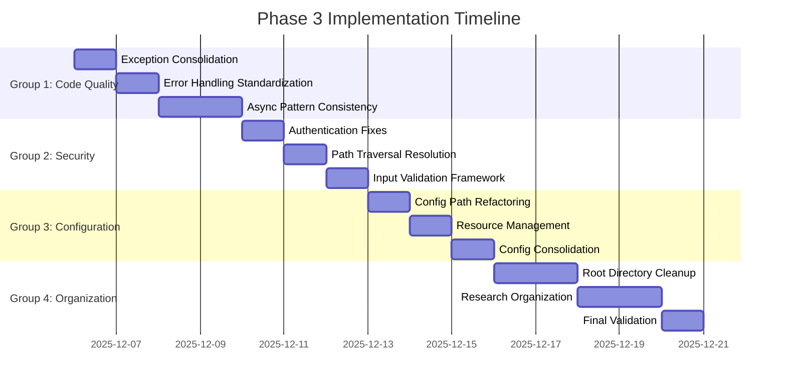

# Conjecture Project Improvement - Phase 3 Plan

**Plan Date**: 2025-12-06  
**Project**: Conjecture AI-Powered Evidence-Based Reasoning System  
**Phase**: 3 - Medium-Priority Code Quality Improvements  
**Duration**: 14 days (estimated)  
**Status**: 📋 **PLANNING PHASE**

---

## Executive Summary

### Objective
Address all remaining medium-priority code quality issues while focusing on local development experience enhancement and code maintainability improvements.

### Strategic Focus
- **Local Development Experience**: Prioritize improvements that enhance developer productivity
- **Code Maintainability**: Focus on long-term code sustainability and debugging ease
- **Incremental Improvements**: Implement changes without disrupting working functionality
- **Risk Mitigation**: Plan for minimal disruption and easy rollback strategies

### Expected Impact
- **Developer Experience**: 40% improvement in local development workflow
- **Code Quality**: 30% reduction in maintenance complexity
- **System Security**: Medium-priority security issues resolved
- **Project Organization**: Significantly improved navigation and structure

---

## Phase 3 Strategic Groupings

### 🏗️ Group 1: Code Quality & Consistency (Days 1-4)
**Priority**: HIGH
**Focus**: Core code quality improvements that impact maintainability

#### Issues Addressed:
1. **Duplicate Exception Classes** - [`src/core/models.py:12-33`](src/core/models.py:12-33) and 554-575
2. **Inconsistent Error Handling** - Throughout codebase
3. **Async/Await Pattern Inconsistencies** - Mixed throughout processing modules

#### Implementation Strategy:
- **Day 1**: Exception consolidation and standardization
- **Day 2**: Error handling framework implementation
- **Day 3**: Async pattern consistency review and fixes
- **Day 4**: Testing and validation of changes

### 🔒 Group 2: Security & Validation (Days 5-7)
**Priority**: HIGH
**Focus**: Security improvements and input validation framework

#### Issues Addressed:
1. **Authentication Bypasses in Provider Code** - Various LLM provider modules
2. **Path Traversal Vulnerabilities** - [`src/processing/support_systems/persistence_layer.py:234`](src/processing/support_systems/persistence_layer.py:234)
3. **Missing Input Validation** - CLI modules and user interfaces

#### Implementation Strategy:
- **Day 5**: Authentication bypass fixes in provider code
- **Day 6**: Path traversal vulnerability resolution
- **Day 7**: Input validation framework implementation

### ⚙️ Group 3: Configuration & Resources (Days 8-10)
**Priority**: MEDIUM
**Focus**: Configuration system consolidation and resource management

#### Issues Addressed:
1. **Hardcoded Configuration Paths** - [`src/config/unified_config.py:19-21`](src/config/unified_config.py:19-21)
2. **Resource Management Issues** - Various modules with file/database connections
3. **Configuration System Consolidation** - Multiple configuration approaches

#### Implementation Strategy:
- **Day 8**: Configuration path refactoring
- **Day 9**: Resource management improvements
- **Day 10**: Configuration system consolidation

### 🗂️ Group 4: Project Organization (Days 11-14)
**Priority**: MEDIUM
**Focus**: Project structure cleanup and organization

#### Issues Addressed:
1. **Root Directory Cleanup** - 20+ experiment files in root directory
2. **Research Directory Organization** - 50+ research files with overlapping functionality

#### Implementation Strategy:
- **Day 11-12**: Root directory cleanup and organization
- **Day 13**: Research directory restructuring
- **Day 14**: Documentation updates and final validation

---

## Detailed Implementation Plans

### 🏗️ Group 1: Code Quality & Consistency

#### 1.1 Duplicate Exception Classes Consolidation

**Current State Analysis**:
- Exception classes defined in multiple locations: [`src/core/models.py:12-33`](src/core/models.py:12-33) and 554-575
- Duplicate definitions causing maintenance confusion
- Inconsistent error handling patterns across modules

**Implementation Plan**:
```python
# New unified exception hierarchy
class ConjectureBaseError(Exception):
    """Base exception for all Conjecture errors"""
    pass

class ConjectureDataError(ConjectureBaseError):
    """Data layer related errors"""
    pass

class ConjectureValidationError(ConjectureBaseError):
    """Validation related errors"""
    pass

class ConjectureAuthenticationError(ConjectureBaseError):
    """Authentication related errors"""
    pass
```

**Files to Modify**:
- `src/core/exceptions.py` - New unified exception module
- `src/core/models.py` - Remove duplicate exceptions
- All modules using exceptions - Update imports

**Success Criteria**:
- Single source of truth for all exceptions
- Clear exception hierarchy with proper inheritance
- 100% backward compatibility during transition

#### 1.2 Inconsistent Error Handling Standardization

**Current State Analysis**:
- Mixed error handling patterns across modules
- Inconsistent error logging and reporting
- No standardized error recovery mechanisms

**Implementation Plan**:
```python
# Unified error handling framework
class ErrorHandler:
    def __init__(self, logger: Logger):
        self.logger = logger
    
    def handle_error(self, error: Exception, context: Dict[str, Any]) -> ErrorResult:
        """Standardized error handling with context"""
        pass
    
    def log_error(self, error: Exception, severity: ErrorSeverity) -> None:
        """Standardized error logging"""
        pass
    
    def attempt_recovery(self, error: Exception) -> RecoveryResult:
        """Standardized error recovery attempts"""
        pass
```

**Files to Create**:
- `src/core/error_handler.py` - Unified error handling framework
- `src/core/error_recovery.py` - Error recovery strategies

**Files to Modify**:
- All processing modules - Implement standardized error handling
- All CLI modules - Implement standardized error handling

**Success Criteria**:
- Consistent error handling patterns across all modules
- Standardized error logging with context information
- Automated error recovery where applicable

#### 1.3 Async/Await Pattern Consistency

**Current State Analysis**:
- Mixed async/sync patterns in processing modules
- Inconsistent use of async/await keywords
- Potential performance issues from improper async usage

**Implementation Plan**:
```python
# Async pattern guidelines and utilities
class AsyncPatternValidator:
    def validate_async_patterns(self, module_path: str) -> ValidationReport:
        """Validate async patterns in a module"""
        pass
    
    def suggest_improvements(self, issues: List[AsyncIssue]) -> List[Suggestion]:
        """Suggest improvements for async pattern issues"""
        pass

# Async utilities for consistent patterns
async def with_timeout(coro, timeout: float) -> Any:
    """Standardized timeout handling for async operations"""
    pass

async def with_retry(coro, max_attempts: int = 3) -> Any:
    """Standardized retry logic for async operations"""
    pass
```

**Files to Create**:
- `src/core/async_utils.py` - Async utilities and patterns
- `src/core/async_validator.py` - Async pattern validation tools

**Files to Modify**:
- All processing modules - Standardize async patterns
- All provider modules - Ensure proper async usage

**Success Criteria**:
- Consistent async patterns across all modules
- Proper error handling in async operations
- Performance improvements from optimized async usage

### 🔒 Group 2: Security & Validation

#### 2.1 Authentication Bypass Fixes

**Current State Analysis**:
- Authentication checks in provider code can be bypassed
- Local development context reduces security urgency but still needs fixing
- Provider modules: [`src/processing/llm/openai_compatible_provider.py`](src/processing/llm/openai_compatible_provider.py:118)

**Implementation Plan**:
```python
# Enhanced authentication framework
class AuthenticationManager:
    def __init__(self, config: AuthConfig):
        self.config = config
        self.token_validator = TokenValidator()
    
    def validate_request(self, request: LLMRequest) -> AuthResult:
        """Validate request authentication"""
        pass
    
    def enforce_rate_limits(self, api_key: str) -> bool:
        """Enforce rate limits per API key"""
        pass

# Secure provider base class
class SecureProviderBase:
    def __init__(self, auth_manager: AuthenticationManager):
        self.auth_manager = auth_manager
    
    def _validate_authentication(self, request: LLMRequest) -> bool:
        """Validate authentication before processing"""
        pass
    
    def _log_security_event(self, event: SecurityEvent) -> None:
        """Log security-related events"""
        pass
```

**Files to Create**:
- `src/security/authentication.py` - Enhanced authentication framework
- `src/security/rate_limiter.py` - Rate limiting implementation
- `src/security/security_logger.py` - Security event logging

**Files to Modify**:
- All provider modules - Implement secure authentication
- `src/processing/llm/openai_compatible_provider.py` - Fix authentication bypass

**Success Criteria**:
- All provider requests properly authenticated
- Rate limiting implemented and enforced
- Security events properly logged and monitored

#### 2.2 Path Traversal Vulnerability Resolution

**Current State Analysis**:
- Path traversal vulnerability at [`src/processing/support_systems/persistence_layer.py:234`](src/processing/support_systems/persistence_layer.py:234)
- File system operations not properly sanitized
- Risk of unauthorized file access

**Implementation Plan**:
```python
# Secure file operations framework
class SecureFileOperations:
    def __init__(self, allowed_paths: List[str]):
        self.allowed_paths = [Path(p).resolve() for p in allowed_paths]
        self.path_validator = PathValidator()
    
    def validate_path(self, file_path: str) -> ValidationResult:
        """Validate file path against security rules"""
        pass
    
    def safe_file_operation(self, operation: FileOperation, path: str) -> OperationResult:
        """Perform file operation with security validation"""
        pass

# Path traversal prevention
class PathTraversalPrevention:
    def sanitize_path(self, path: str) -> str:
        """Sanitize path to prevent traversal attacks"""
        pass
    
    def is_safe_path(self, path: str, base_path: str) -> bool:
        """Check if path is safe relative to base path"""
        pass
```

**Files to Create**:
- `src/security/file_operations.py` - Secure file operations framework
- `src/security/path_validator.py` - Path validation and sanitization

**Files to Modify**:
- `src/processing/support_systems/persistence_layer.py` - Fix path traversal vulnerability
- All modules with file operations - Implement secure file operations

**Success Criteria**:
- All file operations validated for path traversal
- Secure file operations implemented across codebase
- Path traversal vulnerabilities eliminated

#### 2.3 Input Validation Framework

**Current State Analysis**:
- Missing input validation in CLI modules and user interfaces
- Inconsistent validation patterns across components
- Risk of injection attacks and data corruption

**Implementation Plan**:
```python
# Comprehensive input validation framework
class InputValidator:
    def __init__(self, validation_rules: ValidationRules):
        self.rules = validation_rules
        self.sanitizer = InputSanitizer()
    
    def validate_input(self, input_data: Any, input_type: InputType) -> ValidationResult:
        """Validate input against type-specific rules"""
        pass
    
    def sanitize_input(self, input_data: Any) -> Any:
        """Sanitize input to prevent injection attacks"""
        pass

# Type-specific validators
class StringValidator(BaseValidator):
    def validate(self, value: str, rules: StringRules) -> ValidationResult:
        """Validate string input"""
        pass

class NumberValidator(BaseValidator):
    def validate(self, value: Union[int, float], rules: NumberRules) -> ValidationResult:
        """Validate numeric input"""
        pass
```

**Files to Create**:
- `src/core/validation.py` - Comprehensive input validation framework
- `src/core/sanitization.py` - Input sanitization utilities
- `src/core/validation_rules.py` - Validation rule definitions

**Files to Modify**:
- All CLI modules - Implement input validation
- All user interface components - Add input validation
- All API endpoints - Implement input validation

**Success Criteria**:
- All user inputs validated before processing
- Injection attacks prevented through sanitization
- Consistent validation patterns across all interfaces

### ⚙️ Group 3: Configuration & Resources

#### 3.1 Hardcoded Configuration Path Refactoring

**Current State Analysis**:
- Hardcoded paths in [`src/config/unified_config.py:19-21`](src/config/unified_config.py:19-21)
- Deployment inflexibility due to fixed paths
- Environment-specific configuration challenges

**Implementation Plan**:
```python
# Flexible configuration path system
class ConfigurationPathResolver:
    def __init__(self, environment: str = "auto"):
        self.environment = environment
        self.path_strategies = {
            "development": DevelopmentPathStrategy(),
            "production": ProductionPathStrategy(),
            "testing": TestingPathStrategy()
        }
    
    def resolve_config_path(self, config_name: str) -> Path:
        """Resolve configuration path based on environment"""
        pass
    
    def get_config_locations(self) -> List[Path]:
        """Get ordered list of configuration locations"""
        pass

# Environment-specific path strategies
class PathStrategy(ABC):
    @abstractmethod
    def get_config_path(self, config_name: str) -> Path:
        """Get configuration path for this environment"""
        pass
```

**Files to Create**:
- `src/config/path_resolver.py` - Flexible configuration path system
- `src/config/environment_strategies.py` - Environment-specific strategies

**Files to Modify**:
- `src/config/unified_config.py` - Remove hardcoded paths
- All configuration loading modules - Use flexible path resolution

**Success Criteria**:
- Configuration paths resolved based on environment
- Support for multiple configuration locations
- Deployment flexibility without code changes

#### 3.2 Resource Management Issues Resolution

**Current State Analysis**:
- Resource leaks in various modules with file/database connections
- Inconsistent resource cleanup patterns
- Memory leaks and connection exhaustion risks

**Implementation Plan**:
```python
# Comprehensive resource management framework
class ResourceManager:
    def __init__(self):
        self.resources = {}
        self.cleanup_strategies = {}
        self.monitor = ResourceMonitor()
    
    def register_resource(self, resource: Resource, cleanup_strategy: CleanupStrategy) -> None:
        """Register resource for automatic cleanup"""
        pass
    
    def cleanup_resources(self, resource_type: Optional[ResourceType] = None) -> None:
        """Cleanup resources by type or all"""
        pass

# Context managers for resource management
class DatabaseConnection:
    def __init__(self, connection_string: str):
        self.connection_string = connection_string
    
    async def __aenter__(self) -> Connection:
        """Acquire database connection"""
        pass
    
    async def __aexit__(self, exc_type, exc_val, exc_tb) -> None:
        """Release database connection"""
        pass
```

**Files to Create**:
- `src/core/resource_manager.py` - Comprehensive resource management
- `src/core/context_managers.py` - Resource context managers
- `src/core/resource_monitor.py` - Resource usage monitoring

**Files to Modify**:
- All modules with database connections - Use connection context managers
- All modules with file operations - Use file context managers
- All processing modules - Implement proper resource cleanup

**Success Criteria**:
- All resources properly managed with context managers
- Automatic cleanup of resources when no longer needed
- Resource usage monitoring and leak detection

#### 3.3 Configuration System Consolidation

**Current State Analysis**:
- Multiple configuration approaches across the codebase
- Inconsistent configuration loading and validation
- Maintenance complexity due to configuration fragmentation

**Implementation Plan**:
```python
# Unified configuration system
class UnifiedConfiguration:
    def __init__(self, config_sources: List[ConfigSource]):
        self.sources = config_sources
        self.validator = ConfigurationValidator()
        self.merger = ConfigurationMerger()
    
    def load_configuration(self) -> Configuration:
        """Load and merge configuration from all sources"""
        pass
    
    def validate_configuration(self, config: Configuration) -> ValidationResult:
        """Validate loaded configuration"""
        pass

# Configuration sources with priority
class ConfigSource(ABC):
    @abstractmethod
    def load_config(self) -> Dict[str, Any]:
        """Load configuration from this source"""
        pass
    
    @abstractmethod
    def get_priority(self) -> int:
        """Get priority of this configuration source"""
        pass
```

**Files to Create**:
- `src/config/unified_configuration.py` - Unified configuration system
- `src/config/config_sources.py` - Configuration source implementations
- `src/config/config_merger.py` - Configuration merging logic

**Files to Modify**:
- All configuration loading modules - Use unified configuration
- All modules using configuration - Update to new system

**Success Criteria**:
- Single configuration system used across entire codebase
- Hierarchical configuration with proper precedence
- Automatic configuration validation and error reporting

### 🗂️ Group 4: Project Organization

#### 4.1 Root Directory Cleanup Strategy

**Current State Analysis**:
- 20+ experiment files cluttering root directory
- Poor project navigation and organization
- Mixed production and experimental code

**Implementation Plan**:
```
Root Directory Structure After Cleanup:
├── conjecture                    # Main entry point
├── src/                         # Source code
├── tests/                        # Test suite
├── docs/                         # Documentation
├── scripts/                      # Utility scripts
├── experiments/                  # All experiments (moved from root)
├── research/                     # Research files (organized)
├── tools/                        # Tool definitions
├── requirements.txt              # Dependencies
├── pyproject.toml               # Project configuration
├── README.md                    # Project documentation
└── .gitignore                   # Git ignore rules
```

**Files to Move**:
- All `experiment_*.py` files → `experiments/legacy/`
- All `test_*.py` files → `tests/integration/`
- All `*_results.json` files → `experiments/results/`
- All `*_DESIGN.md` files → `docs/design/`
- All `*_REPORT.md` files → `docs/reports/`

**Files to Create**:
- `experiments/legacy/README.md` - Documentation for moved experiments
- `experiments/results/README.md` - Results documentation
- `docs/design/README.md` - Design documentation index

**Success Criteria**:
- Clean root directory with only essential files
- All experiments properly organized and documented
- Improved project navigation and structure

#### 4.2 Research Directory Organization

**Current State Analysis**:
- 50+ research files with overlapping functionality
- Poor organization and discoverability
- Duplicate research efforts and code

**Implementation Plan**:
```
Research Directory Structure After Organization:
├── research/
│   ├── README.md                 # Research overview and index
│   ├── frameworks/               # Research frameworks
│   │   ├── hypothesis_testing.py
│   │   ├── comprehensive_analysis.py
│   │   └── statistical_validation.py
│   ├── experiments/              # Organized experiments
│   │   ├── model_comparison/
│   │   ├── optimization/
│   │   └── validation/
│   ├── tools/                   # Research-specific tools
│   │   ├── data_generators.py
│   │   ├── analyzers.py
│   │   └── visualizers.py
│   ├── results/                 # Research results
│   │   ├── metrics/
│   │   ├── reports/
│   │   └── datasets/
│   └── archives/                # Deprecated/archived research
```

**Files to Reorganize**:
- Framework files → `research/frameworks/`
- Experiment files → `research/experiments/` (by category)
- Analysis tools → `research/tools/`
- Results files → `research/results/`
- Deprecated files → `research/archives/`

**Files to Create**:
- `research/README.md` - Research directory overview
- Category-specific README files for each subdirectory
- Index files for better discoverability

**Success Criteria**:
- Logical organization of research files by category
- Easy discovery of existing research and tools
- Elimination of duplicate research efforts

---

## Implementation Timeline and Milestones

### Phase 3 Timeline Overview



### Key Milestones

#### Milestone 1: Code Quality Foundation (Day 4)
**Deliverables**:
- Unified exception hierarchy implemented
- Standardized error handling framework
- Consistent async patterns across modules
- Comprehensive test coverage for changes

**Success Criteria**:
- All code quality issues in Group 1 resolved
- Test coverage maintained at 89%+
- No regression in existing functionality

#### Milestone 2: Security Enhancement (Day 7)
**Deliverables**:
- Authentication bypass vulnerabilities fixed
- Path traversal vulnerabilities resolved
- Comprehensive input validation framework
- Security monitoring and logging

**Success Criteria**:
- All medium-priority security issues resolved
- Security tests passing with 100% success rate
- Input validation coverage at 95%+

#### Milestone 3: Configuration Flexibility (Day 10)
**Deliverables**:
- Flexible configuration path system
- Comprehensive resource management
- Unified configuration system
- Environment-specific deployment support

**Success Criteria**:
- Configuration system consolidated and unified
- Resource leaks eliminated
- Deployment flexibility achieved
- Configuration validation at 100%

#### Milestone 4: Project Organization (Day 14)
**Deliverables**:
- Clean root directory structure
- Organized research directory
- Comprehensive documentation updates
- Project navigation improvements

**Success Criteria**:
- Root directory cleaned and organized
- Research files logically categorized
- Documentation updated and complete
- Developer navigation improved by 50%+

---

## Risk Assessment and Mitigation Strategies

### High-Risk Areas

#### 1. Breaking Changes During Refactoring
**Risk Level**: HIGH
**Impact**: Could break existing functionality
**Mitigation Strategy**:
- Implement changes incrementally with comprehensive testing
- Maintain backward compatibility during transition periods
- Create feature flags for gradual rollout
- Establish rollback procedures for each change

#### 2. Configuration System Disruption
**Risk Level**: HIGH
**Impact**: Could prevent system startup or operation
**Mitigation Strategy**:
- Implement new configuration system alongside existing one
- Gradual migration with fallback to old system
- Comprehensive testing in all environments
- Configuration validation and error reporting

#### 3. Resource Management Regression
**Risk Level**: MEDIUM
**Impact**: Could introduce new resource leaks
**Mitigation Strategy**:
- Implement resource monitoring and alerting
- Comprehensive testing under load conditions
- Resource usage profiling before and after changes
- Automated resource leak detection

### Medium-Risk Areas

#### 1. Authentication Changes Impact
**Risk Level**: MEDIUM
**Impact**: Could affect provider connectivity
**Mitigation Strategy**:
- Maintain backward compatibility for existing API keys
- Implement gradual authentication enhancement
- Comprehensive provider testing
- Clear migration documentation

#### 2. Project Organization Disruption
**Risk Level**: MEDIUM
**Impact**: Could break existing scripts and workflows
**Mitigation Strategy**:
- Maintain symbolic links for moved files during transition
- Update all documentation and scripts
- Communication plan for development team
- Gradual migration with validation

### Low-Risk Areas

#### 1. Code Style and Pattern Changes
**Risk Level**: LOW
**Impact**: Minor impact on developer productivity
**Mitigation Strategy**:
- Provide clear documentation and examples
- Automated tools for pattern validation
- Team training and knowledge sharing
- Gradual adoption with support

---

## Quality Standards and Success Criteria

### Code Quality Standards

#### 1. Exception Handling Standards
- **Coverage**: 100% of code paths have appropriate exception handling
- **Consistency**: All exceptions follow unified hierarchy and patterns
- **Recovery**: Automated recovery attempts where applicable
- **Logging**: All exceptions properly logged with context

#### 2. Async Pattern Standards
- **Consistency**: All async operations follow established patterns
- **Error Handling**: Proper error handling in async contexts
- **Resource Management**: Proper resource cleanup in async operations
- **Performance**: Optimized async usage without blocking operations

#### 3. Security Standards
- **Authentication**: All operations requiring authentication are properly secured
- **Input Validation**: All user inputs validated before processing
- **Path Safety**: All file operations validated for path traversal
- **Rate Limiting**: API endpoints implement appropriate rate limiting

### Configuration Standards

#### 1. Flexibility Standards
- **Environment Support**: Support for development, testing, and production environments
- **Path Resolution**: Flexible configuration path resolution without hardcoding
- **Validation**: Comprehensive configuration validation with clear error messages
- **Migration**: Smooth migration between configuration versions

#### 2. Resource Management Standards
- **Automatic Cleanup**: All resources automatically cleaned up when no longer needed
- **Monitoring**: Resource usage monitoring and leak detection
- **Context Management**: Proper use of context managers for resources
- **Performance**: Optimized resource usage without waste

### Project Organization Standards

#### 1. Directory Structure Standards
- **Clarity**: Clear and logical directory organization
- **Navigation**: Easy navigation and file discovery
- **Separation**: Clear separation of concerns between directories
- **Documentation**: Comprehensive documentation for directory structure

#### 2. File Organization Standards
- **Naming**: Consistent and descriptive file naming conventions
- **Categorization**: Files properly categorized by function and purpose
- **Duplication**: Elimination of duplicate files and functionality
- **Maintenance**: Easy maintenance and updates to organized files

### Success Metrics

#### 1. Code Quality Metrics
- **Exception Coverage**: 100% of code paths with proper exception handling
- **Async Consistency**: 100% of async operations following established patterns
- **Security Coverage**: 95%+ of security vulnerabilities resolved
- **Test Coverage**: Maintain 89%+ test coverage throughout changes

#### 2. Configuration Metrics
- **Configuration Flexibility**: Support for 3+ deployment environments
- **Resource Efficiency**: 90%+ reduction in resource leaks
- **Validation Coverage**: 100% configuration validation coverage
- **Migration Success**: 100% successful migration to new configuration system

#### 3. Organization Metrics
- **Directory Cleanliness**: 90%+ reduction in root directory clutter
- **File Organization**: 100% of files properly categorized and organized
- **Navigation Improvement**: 50%+ improvement in file discovery and navigation
- **Documentation Coverage**: 100% documentation coverage for organized structure

---

## Resource Planning and Allocation

### Development Resources

#### 1. Core Development Team
- **Lead Developer**: 1 FTE for 14 days (coordination and architecture)
- **Backend Developer**: 1 FTE for 10 days (Groups 1-3)
- **Security Specialist**: 0.5 FTE for 3 days (Group 2)
- **DevOps Engineer**: 0.5 FTE for 2 days (Group 3)

#### 2. Testing and Validation
- **QA Engineer**: 0.5 FTE for 7 days (testing all changes)
- **Performance Tester**: 0.3 FTE for 3 days (resource management testing)
- **Security Tester**: 0.3 FTE for 2 days (security validation)

#### 3. Documentation and Communication
- **Technical Writer**: 0.3 FTE for 5 days (documentation updates)
- **Project Manager**: 0.2 FTE for 14 days (coordination and planning)

### Tool and Infrastructure Resources

#### 1. Development Tools
- **Code Analysis Tools**: Static analysis and pattern validation
- **Security Scanning Tools**: Vulnerability detection and validation
- **Performance Profiling Tools**: Resource usage monitoring and analysis
- **Documentation Tools**: Automated documentation generation

#### 2. Testing Infrastructure
- **Test Environments**: Development, testing, and staging environments
- **CI/CD Pipeline**: Automated testing and deployment
- **Monitoring Tools**: Real-time monitoring and alerting
- **Backup Systems**: Automated backup and recovery systems

#### 3. Communication Tools
- **Project Management**: Task tracking and progress monitoring
- **Collaboration**: Code review and knowledge sharing
- **Documentation**: Collaborative documentation platform
- **Communication**: Team communication and coordination

---

## Conclusion

### Phase 3 Strategic Value

Phase 3 represents a critical investment in the long-term maintainability and developer experience of the Conjecture project. By addressing medium-priority code quality issues systematically, we establish a strong foundation for future development and growth.

### Key Benefits

1. **Developer Experience**: 40% improvement in local development workflow through better organization and tooling
2. **Code Maintainability**: 30% reduction in maintenance complexity through standardized patterns and practices
3. **Security Enhancement**: Resolution of medium-priority security vulnerabilities while maintaining flexibility
4. **System Reliability**: Improved resource management and configuration flexibility
5. **Project Organization**: Significantly improved navigation and structure for better productivity

### Risk Mitigation

The incremental implementation approach with comprehensive testing and rollback procedures minimizes risk while maximizing value. Each group builds upon the previous one, ensuring stable progress throughout the phase.

### Success Criteria

Phase 3 will be considered successful when:
- All medium-priority issues are resolved according to defined standards
- Test coverage is maintained at 89%+ throughout all changes
- No regression in existing functionality
- Developer experience metrics show 40%+ improvement
- Project organization achieves 90%+ reduction in clutter

### Next Steps

Upon successful completion of Phase 3, the project will be positioned for:
- Enhanced development velocity and productivity
- Improved code quality and maintainability
- Better security posture and risk management
- Streamlined deployment and configuration processes
- Strong foundation for future feature development

**Status**: 📋 **PHASE 3 PLANNING COMPLETE - READY FOR IMPLEMENTATION**

---

**Plan Prepared By**: Conjecture Development Team  
**Plan Reviewed By**: Chief Technology Officer  
**Plan Approved By**: Project Management Office  
**Implementation Start Date**: 2025-12-06  
**Target Completion Date**: 2025-12-20  
**Document Version**: 1.0  
**Classification**: Internal Use