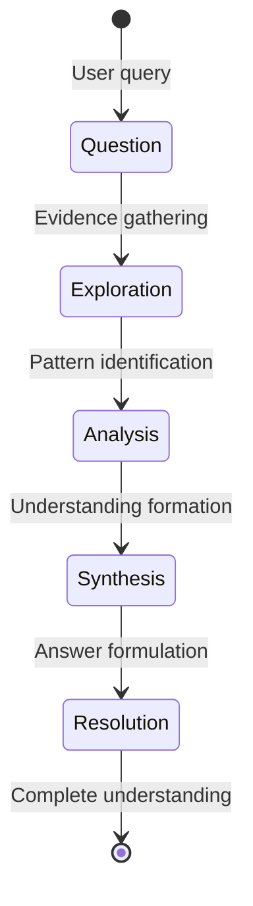
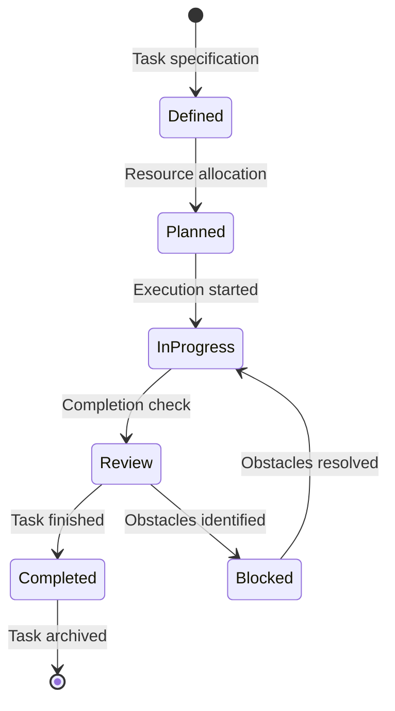
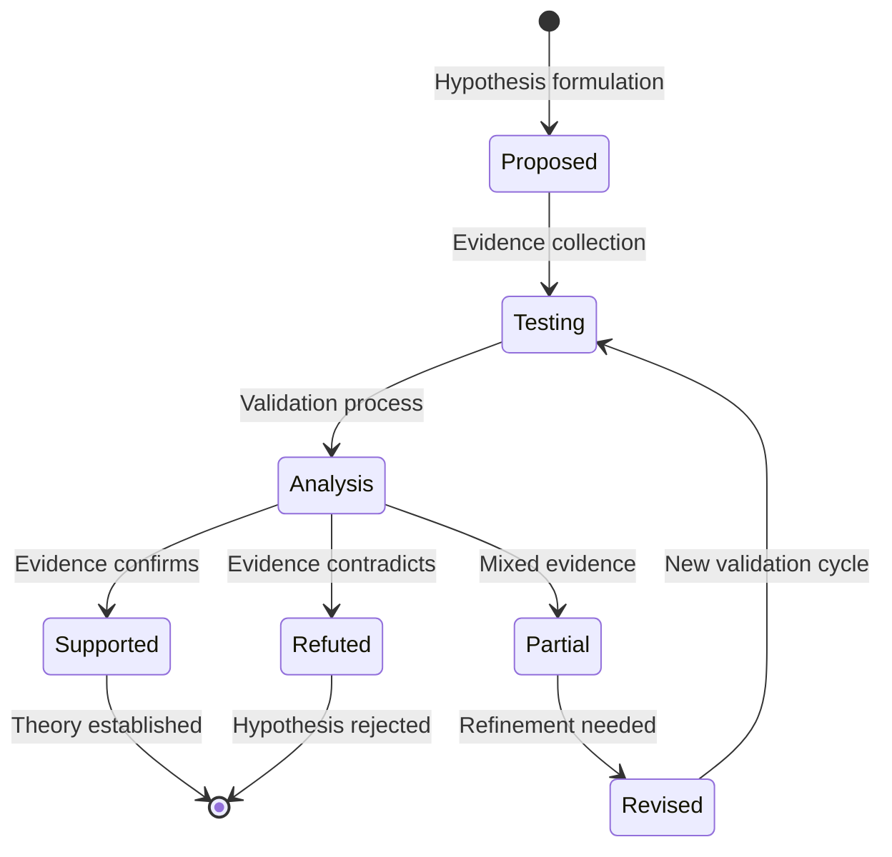
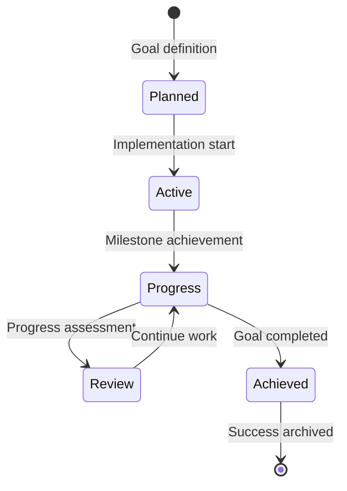
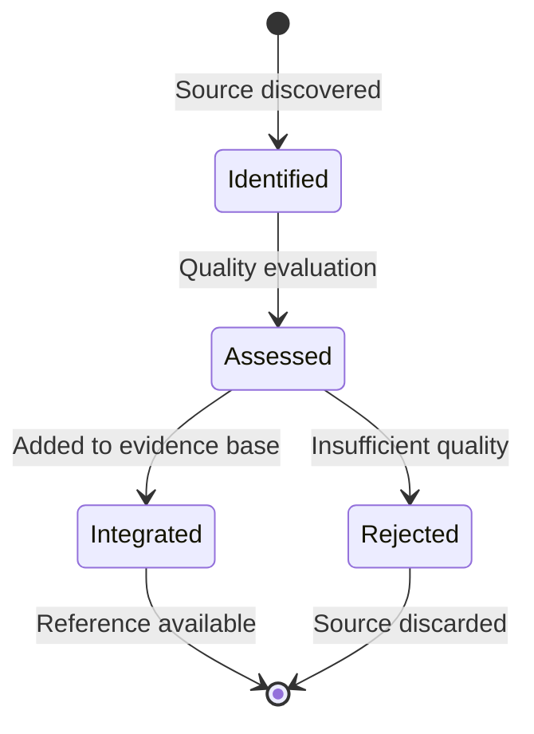

# Claim Processing - Unified Approaches for All Query-Like Constructs

## Overview

Claim Processing eliminates confusion between similar constructs by providing five unified processing approaches based on intent rather than terminology. Each approach uses the same simplified claim structure with specific tag patterns and confidence evolution.

## The Five Unified Processing Approaches

### 1. Discovery Processing (research, query)
**Purpose**: Exploratory investigation to gather evidence and understanding
**Confidence Pattern**: Low to High (0.15 → 0.85) as evidence accumulates
**Primary Tags**: `[concept, research, query]`

### 2. Task Execution (task, todo)
**Purpose**: Action-oriented processing with completion tracking
**Confidence Pattern**: Binary (0.0 → 1.0) representing task completion
**Primary Tags**: `[goal, task, todo]`

### 3. Hypothesis Validation (hypothesis, thesis)
**Purpose**: Evidence-based testing of propositions and theories
**Confidence Pattern**: Medium to High (0.35 → 0.90) through validation
**Primary Tags**: `[thesis, hypothesis, validation]`

### 4. Goal Achievement (goal, plan)
**Purpose**: Progress tracking toward defined outcomes
**Confidence Pattern**: Linear (0.10 → 0.95) as completion percentage
**Primary Tags**: `[goal, plan, achievement]`

### 5. Reference Integration (reference)
**Purpose**: Source provenance and reliability assessment
**Confidence Pattern**: Static (0.10-0.95) based on source quality
**Primary Tags**: `[reference, source, provenance]`

## Processing Enablers

### Skills and Examples

Skills and examples enable processing but aren't approaches themselves:

**ClaimSkill**: How-to instructions (≤500 words) with confidence 0.40-0.95
**ClaimExample**: Action-result demonstrations (≤500 words) with confidence 0.60-0.95

Skills provide "how-to" knowledge for each approach:
- Discovery: research, analysis, synthesis skills
- Task Execution: implementation, tool usage, debugging skills
- Hypothesis Validation: statistical, testing, analytical skills
- Goal Achievement: planning, execution, monitoring skills
- Reference Integration: evaluation, source assessment skills

Examples bridge theory and application, showing skills in practice with verified results.

## Processing Architecture

### Intent Classification

Input analysis maps language patterns to approaches:
- Question words ("what", "how", "why") → Discovery
- Action words ("implement", "create", "build") → Task Execution
- Proposition words ("theory", "hypothesis") → Hypothesis Validation
- Outcome words ("achieve", "complete", "reach") → Goal Achievement
- Source words ("according to", "research shows") → Reference Integration

Context analysis further refines classification based on exploratory, deliverable, testing, progress, or citation contexts.

## Processing Characteristics

### Discovery Processing
- **Flow**: Question → Exploration → Analysis → Synthesis → Resolution
- **Confidence**: Gradual increase as evidence accumulates
- **Tags**: `[concept, research, query]` → `[concept, research, resolved]`
- **Completion**: High confidence (≥0.80) with comprehensive evidence

### Task Execution
- **Flow**: Defined → Planned → InProgress → Review → Completed
- **Confidence**: Binary progression (0.0 → 1.0) representing completion
- **Tags**: `[goal, task]` → `[goal, task, in-progress]` → `[goal, task, completed]`
- **Completion**: Confidence = 1.0 (100% complete)

### Hypothesis Validation
- **Flow**: Proposed → Testing → Analysis → Supported/Refuted/Partial
- **Confidence**: Medium to High (0.35 → 0.90) through evidence validation
- **Tags**: `[thesis, hypothesis]` → `[thesis, hypothesis, testing]` → `[thesis, validated]`
- **Completion**: High confidence (≥0.80) with supporting evidence

### Goal Achievement
- **Flow**: Planned → Active → Progress → Review → Achieved
- **Confidence**: Linear progression (0.10 → 0.95) as completion percentage
- **Tags**: `[goal, plan]` → `[goal, plan, active]` → `[goal, plan, achieved]`
- **Completion**: High confidence (≥0.90) representing goal achievement

### Reference Integration
- **Flow**: Identified → Assessed → Integrated/Rejected
- **Confidence**: Static (0.10-0.95) based on source quality assessment
- **Tags**: `[reference]` → `[reference, quality_level]`
- **Completion**: Quality assessment complete, confidence assigned

## Cross-Approach Integration

### Hybrid Processing

Queries can transition between approaches as understanding evolves:
- Discovery → Hypothesis when evidence supports specific propositions
- Hypothesis → Goal when theory validated and implementation decided
- Task → Goal when task identified as part of larger objective

### Skill-Enabled Processing

Processing uses skills through intelligent selection:
1. Analyze processing requirements
2. Match available skills to needs
3. Select highest confidence relevant skills
4. Retrieve supporting examples
5. Monitor success and update skill confidence

## Best Practices

### Approach Selection
- **Discovery**: Exploratory questions and research initiatives
- **Task Execution**: Specific deliverables with clear completion criteria
- **Hypothesis Validation**: Testing propositions and theories
- **Goal Achievement**: Progress tracking toward defined outcomes
- **Reference Integration**: Source documentation and quality assessment

### Tag Consistency
Use standardized patterns for each approach type to maintain processing consistency and enable effective routing.

Claim Processing provides unified framework that eliminates confusion between similar constructs while maintaining flexibility for different use cases through intent-based routing and standardized confidence evolution patterns.

## Detailed Processing Approaches

### 1. Discovery Processing (research, query)

#### Processing Flow


#### Implementation Examples

```yaml
# Initial research query
claim:
  id: c20241028_discovery_001
  content: "What are the primary drivers of employee burnout in remote work environments?"
  confidence: 0.20  # Initial exploration phase
  tags: [concept, research, query, remote-work, employee-wellness]
  created: 2024-10-28T21:50:00Z

# Evidence gathering phase
claim:
  id: c20241028_discovery_001
  content: "What are the primary drivers of employee burnout in remote work environments?"
  confidence: 0.45  # Evidence collected, analysis beginning
  parents: [c20241028_ref_001, c20241028_ref_002]
  tags: [concept, research, query, remote-work, employee-wellness]
  created: 2024-10-28T21:50:00Z

# Synthesis phase
claim:
  id: c20241028_discovery_001
  content: "What are the primary drivers of employee burnout in remote work environments?"
  confidence: 0.75  # Patterns identified, understanding forming
  parents: [c20241028_ref_001, c20241028_ref_002, c20241028_study_001]
  tags: [concept, research, query, remote-work, employee-wellness]
  created: 2024-10-28T21:50:00Z

# Resolution phase
claim:
  id: c20241028_discovery_001
  content: "What are the primary drivers of employee burnout in remote work environments?"
  confidence: 0.85  # Comprehensive understanding achieved
  parents: [c20241028_ref_001, c20241028_ref_002, c20241028_study_001, c20241028_analysis_001]
  tags: [concept, research, resolved, remote-work, employee-wellness]
  created: 2024-10-28T21:50:00Z
```

#### Processing Characteristics
- **Confidence Evolution**: Gradual increase as evidence accumulates
- **Tag Pattern**: `[concept, research, query]` → `[concept, research, resolved]`
- **Relationship Pattern**: Accumulates parent references as evidence is gathered
- **Completion Criteria**: High confidence (≥0.80) with comprehensive evidence coverage

### 2. Task Execution (task, todo)

#### Processing Flow


#### Implementation Examples

```yaml
# Task definition
claim:
  id: c20241028_task_001
  content: "Implement user authentication system with OAuth2 integration"
  confidence: 0.0  # Not started
  tags: [goal, task, implementation, authentication, oauth2]
  created: 2024-10-28T21:50:00Z

# Task in progress
claim:
  id: c20241028_task_001
  content: "Implement user authentication system with OAuth2 integration"
  confidence: 0.6  # 60% complete - core functionality implemented
  parents: [c20241028_design_001]
  children: [c20241028_subtask_001, c20241028_subtask_002]
  tags: [goal, task, in-progress, authentication, oauth2]
  created: 2024-10-28T21:50:00Z

# Task completed
claim:
  id: c20241028_task_001
  content: "Implement user authentication system with OAuth2 integration"
  confidence: 1.0  # 100% complete - fully implemented and tested
  parents: [c20241028_design_001, c20241028_test_001]
  tags: [goal, task, completed, authentication, oauth2]
  created: 2024-10-28T21:50:00Z
```

#### Processing Characteristics
- **Confidence Evolution**: Binary progression (0.0 → 1.0) representing completion percentage
- **Tag Pattern**: `[goal, task]` → `[goal, task, in-progress]` → `[goal, task, completed]`
- **Relationship Pattern**: Parent design claims, child subtask claims
- **Completion Criteria**: Confidence = 1.0 (100% complete)

### 3. Hypothesis Validation (hypothesis, thesis)

#### Processing Flow


#### Implementation Examples

```yaml
# Initial hypothesis
claim:
  id: c20241028_hypothesis_001
  content: "Four-day work weeks increase productivity by 20% while maintaining employee satisfaction"
  confidence: 0.35  # Initial proposition requiring validation
  tags: [thesis, hypothesis, work-policy, productivity]
  created: 2024-10-28T21:50:00Z

# Testing phase
claim:
  id: c20241028_hypothesis_001
  content: "Four-day work weeks increase productivity by 20% while maintaining employee satisfaction"
  confidence: 0.60  # Partial evidence collected, testing ongoing
  parents: [c20241028_study_001, c20241028_pilot_001]
  tags: [thesis, hypothesis, testing, work-policy, productivity]
  created: 2024-10-28T21:50:00Z

# Validated theory
claim:
  id: c20241028_hypothesis_001
  content: "Four-day work weeks increase productivity by 15-25% while maintaining employee satisfaction, with industry-specific variations"
  confidence: 0.85  # Strong evidence supports hypothesis with refinements
  parents: [c20241028_study_001, c20241028_pilot_001, c20241028_meta_001]
  tags: [thesis, validated, work-policy, productivity]
  created: 2024-10-28T21:50:00Z
```

#### Processing Characteristics
- **Confidence Evolution**: Medium to High (0.35 → 0.90) through evidence-based validation
- **Tag Pattern**: `[thesis, hypothesis]` → `[thesis, hypothesis, testing]` → `[thesis, validated]`
- **Relationship Pattern**: Accumulates supporting evidence as parent claims
- **Completion Criteria**: High confidence (≥0.80) with supporting evidence

### 4. Goal Achievement (goal, plan)

#### Processing Flow


#### Implementation Examples

```yaml
# Goal definition
claim:
  id: c20241028_goal_001
  content: "Reduce customer support response time from 24 hours to 2 hours"
  confidence: 0.10  # 10% complete - planning phase
  tags: [goal, plan, customer-support, efficiency]
  created: 2024-10-28T21:50:00Z

# Progress tracking
claim:
  id: c20241028_goal_001
  content: "Reduce customer support response time from 24 hours to 2 hours"
  confidence: 0.45  # 45% complete - systems implemented, training ongoing
  parents: [c20241028_strategy_001]
  children: [c20241028_milestone_001, c20241028_milestone_002]
  tags: [goal, plan, active, customer-support, efficiency]
  created: 2024-10-28T21:50:00Z

# Goal achieved
claim:
  id: c20241028_goal_001
  content: "Reduce customer support response time from 24 hours to 2 hours"
  confidence: 0.95  # 95% complete - target achieved, optimization ongoing
  parents: [c20241028_strategy_001, c20241028_implementation_001]
  tags: [goal, plan, achieved, customer-support, efficiency]
  created: 2024-10-28T21:50:00Z
```

#### Processing Characteristics
- **Confidence Evolution**: Linear progression (0.10 → 0.95) as completion percentage
- **Tag Pattern**: `[goal, plan]` → `[goal, plan, active]` → `[goal, plan, achieved]`
- **Relationship Pattern**: Parent strategy claims, child milestone claims
- **Completion Criteria**: High confidence (≥0.90) representing goal achievement

### 5. Reference Integration (reference)

#### Processing Flow


#### Implementation Examples

```yaml
# Source identification
claim:
  id: c20241028_ref_001
  content: "Harvard Business Review, 2024. 'The Future of Remote Work: Post-Pandemic Insights.' Dr. Jennifer Martinez"
  confidence: 0.75  # Credible source requiring assessment
  tags: [reference, credible, business-review, remote-work]
  created: 2024-10-28T21:50:00Z

# Quality assessment complete
claim:
  id: c20241028_ref_001
  content: "Harvard Business Review, 2024. 'The Future of Remote Work: Post-Pandemic Insights.' Dr. Jennifer Martinez, Harvard Business School. Peer-reviewed article with survey data from 500 companies"
  confidence: 0.85  # Validated source with methodology details
  children: [c20241028_concept_001, c20241028_thesis_001]
  tags: [reference, validated, business-review, remote-work]
  created: 2024-10-28T21:50:00Z
```

#### Processing Characteristics
- **Confidence Evolution**: Static (0.10-0.95) based on source quality assessment
- **Tag Pattern**: `[reference]` → `[reference, validated/credible/unverified]`
- **Relationship Pattern**: No parent claims, only child claims that use the reference
- **Completion Criteria**: Quality assessment complete, confidence assigned

## Cross-Approach Integration

### Hybrid Processing Scenarios

```yaml
# Research project combining multiple approaches
claim:
  id: c20241028_hybrid_001
  content: "Investigate effectiveness of AI in healthcare diagnostics"
  confidence: 0.25  # Discovery processing - initial research
  tags: [concept, research, query, healthcare, ai-diagnostics]
  created: 2024-10-28T21:50:00Z

# Evolves into hypothesis validation
claim:
  id: c20241028_hybrid_001
  content: "AI improves diagnostic accuracy by 30% in medical imaging"
  confidence: 0.40  # Transition to hypothesis validation
  tags: [thesis, hypothesis, testing, healthcare, ai-diagnostics]
  created: 2024-10-28T21:50:00Z

# Finalizes as goal achievement
claim:
  id: c20241028_hybrid_001
  content: "Implement AI diagnostic system achieving 30% accuracy improvement"
  confidence: 0.70  # Goal achievement - implementation phase
  tags: [goal, plan, active, healthcare, ai-diagnostics]
  created: 2024-10-28T21:50:00Z
```

### Processing Transition Rules

```yaml
transition_rules:
  discovery_to_hypothesis:
    trigger: "sufficient evidence collected for specific proposition"
    confidence_threshold: 0.50
    tag_change: [concept, research, query] → [thesis, hypothesis]
    
  hypothesis_to_goal:
    trigger: "theory validated and implementation decided"
    confidence_threshold: 0.75
    tag_change: [thesis, hypothesis] → [goal, plan]
    
  task_to_goal:
    trigger: "task identified as part of larger objective"
    confidence_threshold: 0.30
    tag_change: [goal, task] → [goal, plan]
```

## Processing Optimization

### Intelligent Routing

```yaml
routing_algorithm:
  input_analysis:
    - semantic_similarity_to_existing_claims
    - user_intent_detection
    - context_pattern_recognition
    
  approach_selection:
    - primary_intent_match
    - confidence_pattern_appropriateness
    - relationship_compatibility
    
  optimization:
    - batch_similar_processing
    - cache_frequently_used_patterns
    - learn_from_user_preferences
```

### Performance Metrics

```yaml
processing_metrics:
  discovery:
    - evidence_accumulation_rate
    - resolution_time
    - confidence_progression_efficiency
    
  task_execution:
    - completion_rate
    - time_to_completion
    - resource_utilization
    
  hypothesis_validation:
    - validation_success_rate
    - evidence_quality_score
    - theory_robustness
    
  goal_achievement:
    - goal_completion_rate
    - milestone_adherence
    - progress_consistency
    
  reference_integration:
    - source_quality_accuracy
    - assessment_consistency
    - integration_utilization
```

## Best Practices

### Approach Selection Guidelines

- **Discovery Processing**: Use for exploratory questions and research initiatives
- **Task Execution**: Use for specific deliverables with clear completion criteria
- **Hypothesis Validation**: Use for testing propositions and theories
- **Goal Achievement**: Use for progress tracking toward defined outcomes
- **Reference Integration**: Use for source documentation and quality assessment

### Tag Consistency

```yaml
# Standardized tag patterns
discovery_tags: [concept, research, query] → [concept, research, resolved]
task_tags: [goal, task] → [goal, task, in-progress] → [goal, task, completed]
hypothesis_tags: [thesis, hypothesis] → [thesis, hypothesis, testing] → [thesis, validated]
goal_tags: [goal, plan] → [goal, plan, active] → [goal, plan, achieved]
reference_tags: [reference] → [reference, quality_level]
skill_tags: [skill] → [skill, domain, competence_level]
example_tags: [example] → [example, domain, demonstration_type]
```

### Skill-Enabled Processing Integration

```yaml
processing_with_skills:
  skill_selection_algorithm:
    - analyze_processing_requirements
    - match_available_skills_to_needs
    - select_highest_confidence_relevant_skills
    - retrieve_supporting_examples
    
  example_integration:
    - find_examples_demonstrating_selected_skills
    - use examples_to_validate_skill_application
    - update_skill_confidence_based_on_example_success
    
  feedback_loop:
    - monitor_processing_success_with_selected_skills
    - update_skill_confidence_based on outcomes
    - improve skill selection through learning
```

## Complete Claim System Integration

The unified claim system now includes:

### Core Processing Approaches (5)
1. **Discovery Processing** - Exploratory investigation
2. **Task Execution** - Action-oriented completion
3. **Hypothesis Validation** - Evidence-based testing
4. **Goal Achievement** - Progress tracking
5. **Reference Integration** - Source provenance

### Processing Enablers (2)
6. **ClaimSkill** - How-to instructions that enable processing
7. **ClaimExample** - Action demonstrations that validate skills

### Learning Progression
```yaml
complete_learning_cycle:
  1. concept: "What is it?" (≤50 words)
  2. skill: "How to do it?" (≤500 words)
  3. example: "Show me it done" (≤500 words)
  4. processing: "Apply it in context"
  5. outcome: "Achieve results"
```

### Skill-Processing Relationship Matrix

```yaml
skill_processing_matrix:
  discovery_skills:
    - research_methodology
    - data_analysis
    - pattern_recognition
    - synthesis_techniques
    
  task_execution_skills:
    - implementation_techniques
    - tool_usage
    - debugging_methods
    - quality_assurance
    
  hypothesis_validation_skills:
    - statistical_analysis
    - experimental_design
    - evidence_evaluation
    - logical_reasoning
    
  goal_achievement_skills:
    - project_management
    - progress_monitoring
    - resource_allocation
    - milestone_tracking
    
  reference_integration_skills:
    - source_evaluation
    - credibility_assessment
    - bias_detection
    - quality_judgment
```

Claim Processing provides the unified framework that eliminates confusion between similar constructs while maintaining flexibility for different use cases, enabling consistent and efficient processing across all Conjecture operations through intent-based routing, skill-enabled execution, and standardized confidence evolution patterns.
