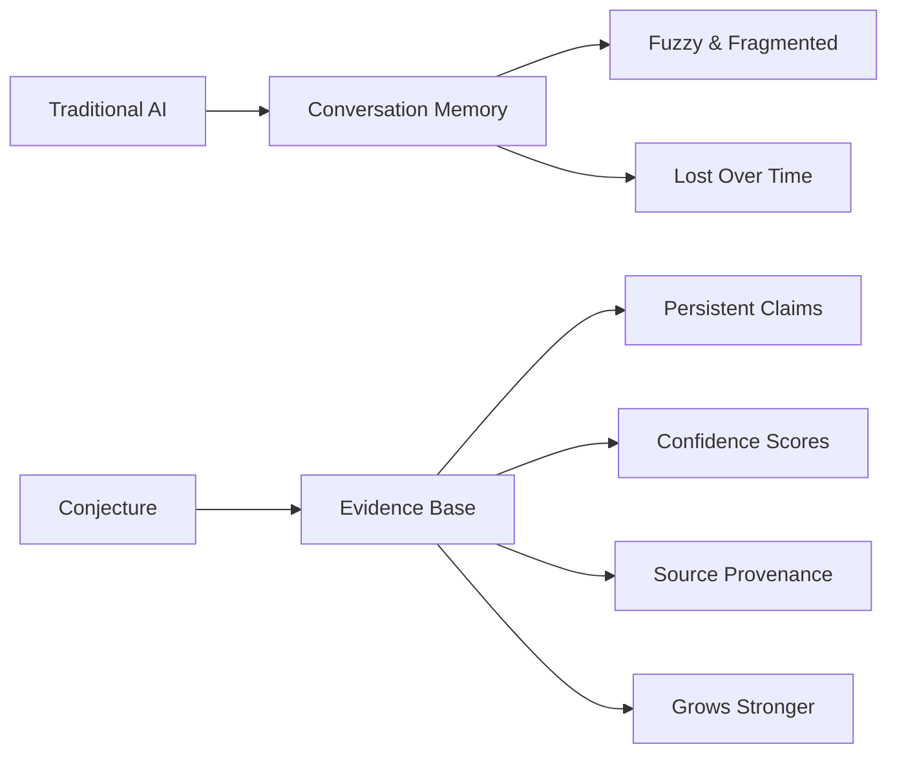
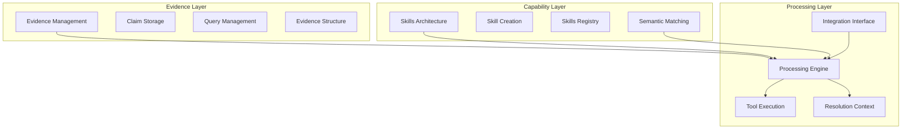
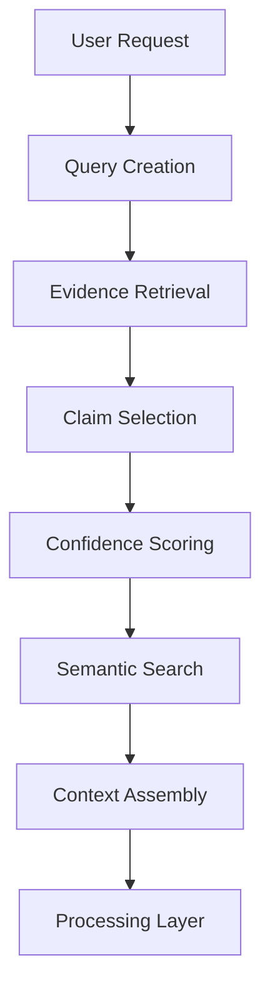
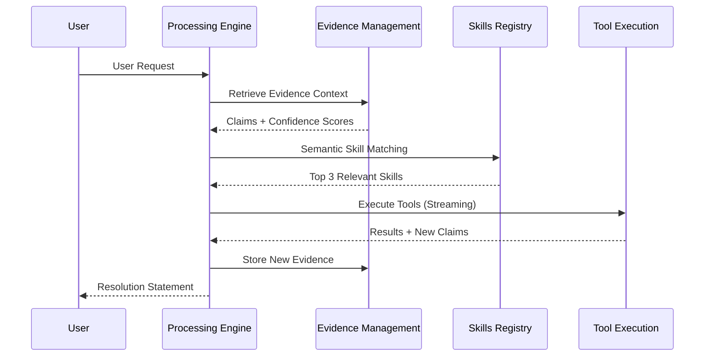
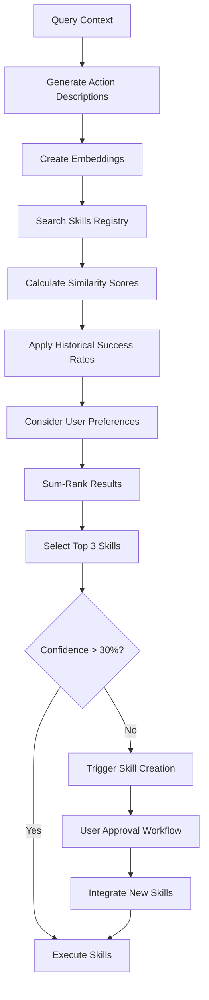
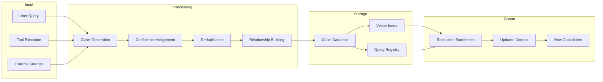
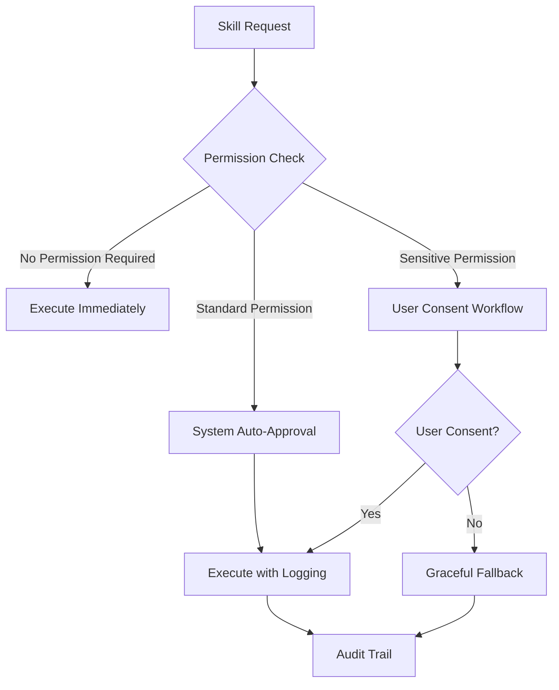
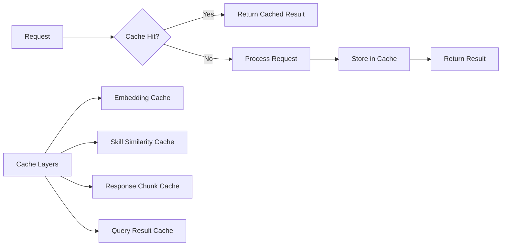

# System Architecture - Complete Technical Reference

## 🎯 **Purpose**

This document serves as the definitive technical architecture reference for Conjecture, consolidating scattered architecture descriptions from multiple documents into a single, comprehensive source. It provides complete system design, component interactions, data flows, and integration patterns while eliminating architectural duplication.

## 🏗️ **Architectural Vision**

### **Core Philosophy: Evidence Over Conversation**

Conjecture transforms AI systems from conversational memory loss to cumulative evidence growth. Instead of maintaining linear dialogue history that becomes fuzzy and fragmented, Conjecture builds a persistent evidence base where every conclusion traces to specific sources with confidence scores.



### **Design Principles**

#### **1. Maximum Power Through Minimum Complexity**
- Single unified claim structure for all information types
- Semantic intelligence over rigid automation
- Self-describing capabilities that market themselves
- Stateless processing with persistent evidence

#### **2. Evidence-Based Reasoning**
- All conclusions trace to specific sources
- Confidence scoring quantifies uncertainty
- Source provenance prevents hallucination
- Systematic quality through validation

#### **3. Self-Improving Capabilities**
- Automatic capability gap detection
- User-guided skill creation and integration
- Semantic discovery without manual configuration
- Continuous adaptation to evolving needs

## 🏛️ **Three-Layer Semantic Intelligence**

### **Architecture Overview**



### **Layer 1: Evidence Layer (ContextMap)**

#### **Purpose**: Persistent claims with confidence scoring and source provenance

**Core Components**:
- **Claim Storage**: Unified YAML structure with semantic search
- **Query Management**: Lifecycle control with priority scoring
- **Evidence Structure**: Deduplication and relationship management
- **Quality Control**: Confidence validation and source verification

**Key Characteristics**:
- Claims instead of absolute facts
- Confidence-weighted reasoning
- Automatic deduplication (cosine similarity > 0.95)
- Resource limits (500MB default, 20 queries max)

#### **Data Flow Architecture**


### **Layer 2: Capability Layer (Skills)**

#### **Purpose**: Self-describing capabilities with semantic discovery

**Core Components**:
- **Skills Architecture**: Single-file skill design with dual execution paths
- **Skill Creation**: Gap detection and user-guided expansion
- **Skills Registry**: Semantic index with pre-computed embeddings
- **Semantic Matching**: Conceptual similarity-based discovery

**Key Characteristics**:
- Natural language capability descriptions
- Semantic discovery without manual registration
- Dual execution paths (Python functions + subprocess)
- Permission-aware security framework

#### **Skill File Structure**
```yaml
skill.md
├── YAML Frontmatter (Machine-Readable)
│   ├── Basic Metadata (name, version, description)
│   ├── Tool Definitions (execution paths, schemas)
│   ├── Permission Manifest (security requirements)
│   └── Dependency Declarations (required capabilities)
└── Markdown Content (Human-Readable)
    ├── Usage Examples and Best Practices
    ├── Capability Explanations and Limitations
    └── Integration Guidelines and Troubleshooting
```

### **Layer 3: Processing Layer (SemanticRecall)**

#### **Purpose**: Intelligent semantic orchestration with resolution tracking

**Core Components**:
- **Processing Engine**: Semantic action generation and skill selection
- **Tool Execution**: Single-threaded execution with streaming responses
- **Resolution Context**: Structured milestones and context gathering
- **Integration Interface**: Cross-component communication protocols

**Key Characteristics**:
- Stateless processing with persistent evidence
- Single-threaded execution for predictability
- Streaming responses for large content handling
- Resolution statements instead of conversation compression

## 🔄 **Component Interaction Patterns**

### **Request Processing Flow**



### **Skill Discovery Process**



### **Evidence Integration Cycle**



## 📊 **Data Architecture**

### **Claim Storage Schema**

```yaml
# Primary Claim Structure
claim:
  id: string                    # Unique identifier
  content: string               # Claim text
  confidence: float             # 0.0-1.0 confidence score
  parents: [string]             # Source claim IDs
  children: [string]            # Dependent claim IDs
  tags: [string]                # Classification tags
  created: datetime             # ISO 8601 timestamp

# Supporting Indexes
indexes:
  semantic_index:
    type: vector
    embedding_model: text-embedding-ada-002
    similarity_algorithm: cosine
    
  confidence_index:
    type: btree
    fields: [confidence, created]
    
  tag_index:
    type: hash
    fields: [tags]
    
  relationship_index:
    type: graph
    edges: [parents, children]
```

### **Query Management Schema**

```yaml
# Query Structure
query:
  id: string                    # Unique identifier
  content: string               # Query text
  state: enum                   # PENDING, PROCESSING, RESOLVED, ORPHANED
  priority: float               # Priority score (0.0-1.0)
  parents: [string]             # Parent query IDs
  children: [string]            # Child query IDs
  evidence_links: [string]      # Related claim IDs
  created: datetime             # Creation timestamp
  updated: datetime             # Last update timestamp

# Query Limits and Constraints
constraints:
  max_queries_per_response: 20
  max_query_depth: 5
  max_child_queries: 10
  default_timeout: 300 seconds
```

### **Skills Registry Schema**

```yaml
# Skill Structure
skill:
  name: string                  # Skill name
  version: string               # Semantic version
  description: string           # Natural language description
  embedding: vector             # Pre-computed embedding
  tools: [tool_definition]      # Available tools
  permissions: [string]         # Required permissions
  dependencies: [string]        # Required skills
  performance_metrics: object   # Historical success rates
  
# Tool Definition
tool_definition:
  name: string                  # Tool name
  description: string           # Tool description
  execution_path: enum          # python, subprocess
  schema: object                # Parameter validation schema
  permissions: [string]         # Tool-specific permissions
```

## 🔧 **Integration Interfaces**

### **Evidence Management APIs**

```yaml
# Claim Operations
claim_api:
  create_claim:
    method: POST
    endpoint: /api/claims
    parameters:
      content: string (required)
      confidence: float (required)
      parents: [string] (optional)
      tags: [string] (required)
    response: claim_object
    
  search_claims:
    method: GET
    endpoint: /api/claims/search
    parameters:
      query: string (required)
      similarity_threshold: float (optional, default: 0.7)
      max_results: integer (optional, default: 50)
      confidence_min: float (optional, default: 0.0)
    response: [claim_object]

# Query Operations
query_api:
  create_query:
    method: POST
    endpoint: /api/queries
    parameters:
      content: string (required)
      priority: float (optional, default: 0.5)
      parent_id: string (optional)
    response: query_object
    
  get_query_context:
    method: GET
    endpoint: /api/queries/{id}/context
    response:
      query: query_object
      evidence: [claim_object]
      related_queries: [query_object]
```

### **Capability System APIs**

```yaml
# Skill Operations
skill_api:
  register_skill:
    method: POST
    endpoint: /api/skills
    parameters:
      skill_file: file (required)
    response: skill_object
    
  discover_skills:
    method: POST
    endpoint: /api/skills/discover
    parameters:
      context: string (required)
      action_hints: [string] (optional)
      max_skills: integer (optional, default: 3)
    response: [skill_recommendation]
    
  execute_skill:
    method: POST
    endpoint: /api/skills/{name}/execute
    parameters:
      tool_name: string (required)
      parameters: object (required)
    response: execution_result
```

### **Processing Engine APIs**

```yaml
# Processing Operations
processing_api:
  process_request:
    method: POST
    endpoint: /api/process
    parameters:
      request: string (required)
      context: object (optional)
      max_claims: integer (optional, default: 50)
    response: processing_result
    
  get_resolution:
    method: GET
    endpoint: /api/resolutions/{query_id}
    response: resolution_statement
```

## 🔒 **Security Architecture**

### **Permission Framework**



### **Security Tiers**

| Tier | Description | Examples | Approval Process |
|------|-------------|----------|------------------|
| **No Permission** | Read-only operations | Data analysis, calculations | Immediate execution |
| **Standard Permission** | System access | File reading, monitoring | System auto-approval |
| **Sensitive Permission** | User data/operations | File modification, network access | User consent required |
| **Critical Permission** | System changes | Skill creation, configuration | Explicit user approval |

### **Security Controls**

```yaml
security_controls:
  input_validation:
    - Parameter type checking
    - SQL injection prevention
    - Code injection protection
    - File path validation
    
  execution_isolation:
    - Sandboxed Python execution
    - Subprocess isolation
    - Resource limits (CPU, memory)
    - Timeout enforcement
    
  audit_logging:
    - Complete operation logging
    - Permission request tracking
    - Error and exception logging
    - Performance monitoring
    
  data_protection:
    - Optional encryption for sensitive claims
    - Access controls for claim modification
    - Backup and recovery procedures
    - Data retention policies
```

## ⚡ **Performance Architecture**

### **Resource Management**

```yaml
resource_constraints:
  database:
    max_size: 500MB
    purge_strategy: remove_lowest_confidence
    purge_percentage: 10%
    
  queries:
    max_per_response: 20
    max_depth: 5
    default_timeout: 300s
    priority_decay_rate: 0.1/day
    
  execution:
    default_timeout: 60s
    max_memory_per_tool: 1GB
    max_concurrent_tools: 1 (single-threaded)
    response_chunk_size: 1000 tokens
```

### **Optimization Strategies**

#### **Caching Architecture**


#### **Performance Metrics**
- **Claim Retrieval**: <100ms for semantic search
- **Skill Discovery**: <200ms for matching
- **Tool Execution**: <60s default timeout
- **Response Generation**: <5s for typical requests
- **Database Operations**: <50ms for indexed queries

## 🔄 **Evolution Architecture**

### **Extensibility Patterns**

```yaml
extension_points:
  claim_types:
    - New claim type definitions
    - Custom validation rules
    - Specialized confidence scoring
    
  skill_capabilities:
    - New execution paths
    - Custom permission types
    - Advanced tool schemas
    
  processing_strategies:
    - Custom semantic matching algorithms
    - Specialized routing rules
    - Enhanced context gathering
    
  integration_interfaces:
    - New API endpoints
    - Custom authentication methods
    - Advanced monitoring hooks
```

### **Migration Support**

```yaml
migration_strategy:
  versioning:
    - Semantic versioning for all components
    - Backward compatibility guarantees
    - Deprecation warnings and timelines
    
  data_migration:
    - Automated schema updates
    - Data validation and cleanup
    - Rollback capabilities
    
  api_evolution:
    - Versioned API endpoints
    - Graceful deprecation periods
    - Migration guides and tools
```

## 📈 **Success Metrics**

### **Architecture Quality Metrics**

| Metric | Target | Measurement Method |
|--------|--------|-------------------|
| **Component Independence** | >90% | Interface analysis, dependency graphs |
| **Performance Consistency** | <10% variance | Load testing, response time analysis |
| **Security Compliance** | 100% | Security audits, penetration testing |
| **Scalability** | 10x load capacity | Stress testing, resource monitoring |
| **Maintainability** | <2 days for changes | Change implementation time tracking |

### **Operational Metrics**

| Metric | Target | Frequency |
|--------|--------|-----------|
| **Uptime** | 99.9% | Continuous monitoring |
| **Response Time** | <5s (95th percentile) | Real-time monitoring |
| **Error Rate** | <1% | Continuous monitoring |
| **Resource Utilization** | <80% | Continuous monitoring |
| **User Satisfaction** | >4.5/5 | Quarterly surveys |

This SystemArchitecture document provides the complete technical foundation for Conjecture, consolidating all architectural knowledge into a single, comprehensive reference that eliminates duplication while providing detailed implementation guidance for all system components.
