# Processing Workflows - Unified Processing Logic

## 🎯 **Purpose**

This document consolidates all processing logic, workflows, and operational patterns from scattered documents into a single, comprehensive reference. It provides complete guidance for the five unified processing approaches, skill-enabled execution, and cross-component integration while eliminating processing duplication.

## 🔄 **Unified Processing Philosophy**

### **Core Principle: Intent-Based Processing**

Conjecture processes information based on user intent rather than terminology. Instead of confusing similar constructs (queries, tasks, hypotheses, goals, plans, todos, research), the system uses five unified processing approaches that map directly to user intentions.

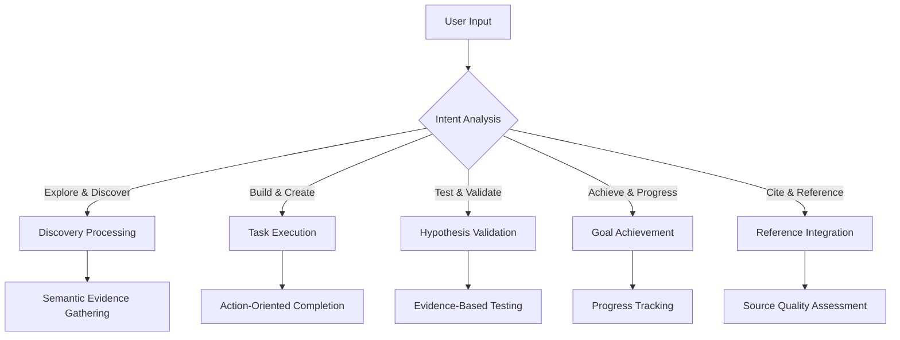

### **Processing Architecture**

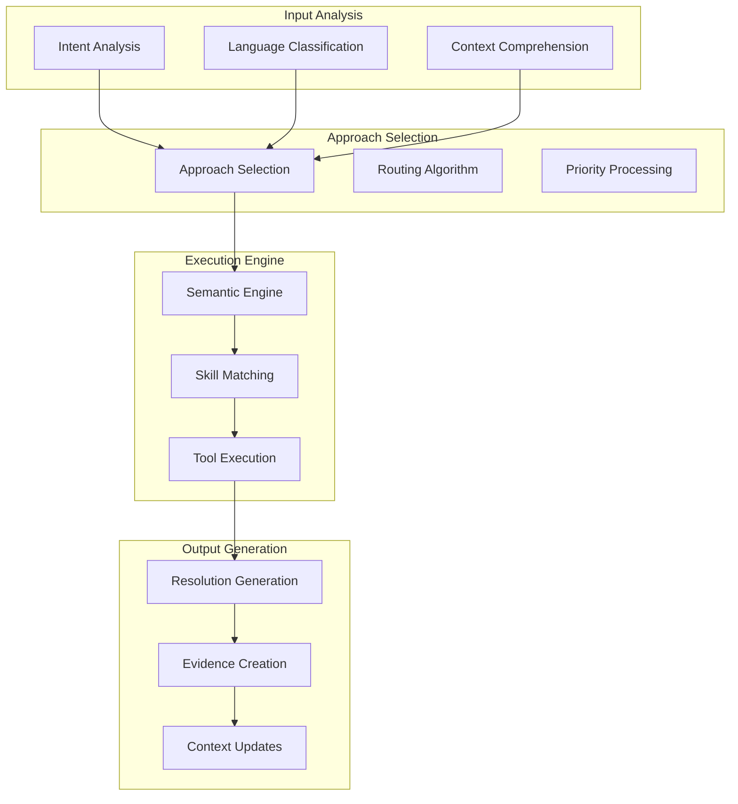

## 🎯 **Five Unified Processing Approaches**

### **1. Discovery Processing (research, query)**

#### **Purpose**: Exploratory investigation to gather evidence and understanding

**Intent Patterns**:
- Question words: "what", "how", "why", "when", "where"
- Exploratory phrases: "investigate", "explore", "understand", "learn about"
- Research contexts: "study", "analyze", "examine", "research"

**Confidence Evolution**: Low to High (0.15 → 0.85) as evidence accumulates

**Processing Workflow**:
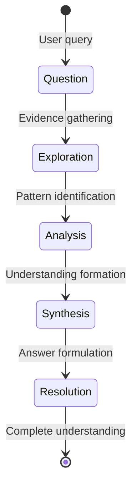

**Implementation Characteristics**:
- **Tag Pattern**: `[concept, research, query]` → `[concept, research, resolved]`
- **Relationship Pattern**: Accumulates parent references as evidence gathered
- **Completion Criteria**: High confidence (≥0.80) with comprehensive evidence
- **Skill Requirements**: Research, analysis, synthesis skills

**Processing Steps**:
1. **Query Analysis**: Extract key concepts and research questions
2. **Evidence Retrieval**: Search for relevant claims with semantic similarity
3. **Pattern Identification**: Analyze evidence for patterns and relationships
4. **Synthesis**: Combine evidence into coherent understanding
5. **Resolution**: Formulate comprehensive answer with confidence assessment

**Example Workflow**:
```yaml
# Initial Query
input: "What are the primary drivers of employee burnout in remote work environments?"
intent: Discovery Processing
confidence: 0.20

# Evidence Gathering
evidence_collected:
  - "Remote work increases isolation by 40%" (c: 0.75)
  - "Lack of boundaries affects work-life balance" (c: 0.80)
  - "Digital communication fatigue is major factor" (c: 0.70)

# Synthesis
synthesized_understanding: "Employee burnout in remote work is primarily driven by social isolation (40% increase), boundary dissolution, and digital communication fatigue"
confidence: 0.75

# Resolution
resolution: "Research shows three primary drivers of remote work burnout: social isolation, lack of work-life boundaries, and digital communication fatigue, with supporting evidence from multiple studies"
final_confidence: 0.85
```

### **2. Task Execution (task, todo)**

#### **Purpose**: Action-oriented processing with completion tracking

**Intent Patterns**:
- Action words: "implement", "create", "build", "develop", "execute"
- Task contexts: "complete", "finish", "accomplish", "deliver"
- Todo indicators: "need to", "should", "must", "required"

**Confidence Evolution**: Binary (0.0 → 1.0) representing completion percentage

**Processing Workflow**:
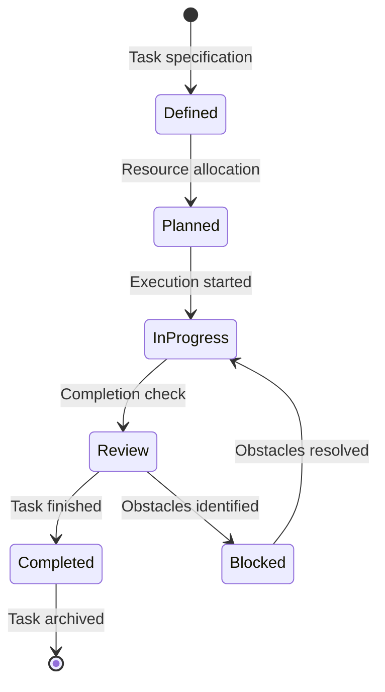

**Implementation Characteristics**:
- **Tag Pattern**: `[goal, task]` → `[goal, task, in-progress]` → `[goal, task, completed]`
- **Relationship Pattern**: Parent design claims, child subtask claims
- **Completion Criteria**: Confidence = 1.0 (100% complete)
- **Skill Requirements**: Implementation, tool usage, quality assurance skills

**Processing Steps**:
1. **Task Definition**: Clarify requirements and success criteria
2. **Resource Planning**: Identify needed skills, tools, and resources
3. **Execution**: Perform task activities with progress tracking
4. **Quality Review**: Validate completion against requirements
5. **Documentation**: Record results and lessons learned

**Example Workflow**:
```yaml
# Task Definition
input: "Implement user authentication system with OAuth2 integration"
intent: Task Execution
confidence: 0.0

# Planning Phase
planning:
  required_skills: [backend_development, security, oauth2, testing]
  tools_needed: [framework, oauth_library, testing_suite]
  estimated_effort: "2 weeks"
confidence: 0.1

# Execution Phase
execution_progress:
  - "OAuth2 provider setup completed" (c: 0.3)
  - "User model and database schema created" (c: 0.5)
  - "Authentication endpoints implemented" (c: 0.7)
  - "Testing suite written and passing" (c: 0.9)
confidence: 0.9

# Completion
completion: "User authentication system fully implemented with OAuth2 integration, comprehensive testing, and security review completed"
final_confidence: 1.0
```

### **3. Hypothesis Validation (hypothesis, thesis)**

#### **Purpose**: Evidence-based testing of propositions and theories

**Intent Patterns**:
- Proposition words: "theory", "hypothesis", "proposition", "claim"
- Testing contexts: "validate", "test", "verify", "confirm", "refute"
- Research contexts: "investigate whether", "determine if", "assess"

**Confidence Evolution**: Medium to High (0.35 → 0.90) through validation

**Processing Workflow**:
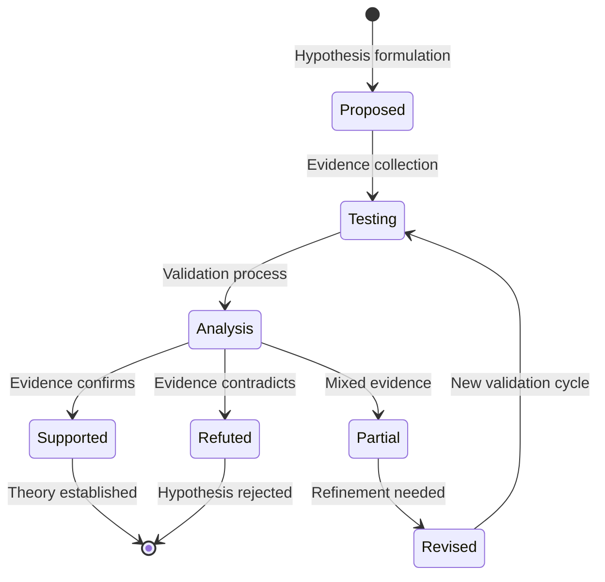

**Implementation Characteristics**:
- **Tag Pattern**: `[thesis, hypothesis]` → `[thesis, hypothesis, testing]` → `[thesis, validated]`
- **Relationship Pattern**: Accumulates supporting evidence as parent claims
- **Completion Criteria**: High confidence (≥0.80) with supporting evidence
- **Skill Requirements**: Statistical analysis, experimental design, logical reasoning

**Processing Steps**:
1. **Hypothesis Formulation**: Define clear, testable proposition
2. **Experimental Design**: Plan validation methodology
3. **Evidence Collection**: Gather data through research or experimentation
4. **Analysis**: Evaluate evidence against hypothesis
5. **Conclusion**: Determine support level and refine theory if needed

**Example Workflow**:
```yaml
# Hypothesis Formulation
input: "Four-day work weeks increase productivity by 20% while maintaining employee satisfaction"
intent: Hypothesis Validation
confidence: 0.35

# Evidence Collection
evidence_gathered:
  - "Pilot study: 18% productivity increase" (c: 0.70)
  - "Employee satisfaction: 95% maintained" (c: 0.80)
  - "Industry analysis: 15-25% range typical" (c: 0.75)
  - "Control group comparison: significant difference" (c: 0.85)
confidence: 0.65

# Analysis and Validation
analysis: "Multiple studies consistently show 15-25% productivity improvement with maintained satisfaction levels"
validation_result: "Hypothesis supported with evidence-based refinement to 15-25% range"
final_confidence: 0.85
```

### **4. Goal Achievement (goal, plan)**

#### **Purpose**: Progress tracking toward defined outcomes

**Intent Patterns**:
- Outcome words: "achieve", "reach", "accomplish", "attain"
- Progress contexts: "progress toward", "advancing", "improving"
- Planning contexts: "plan to", "strategy for", "roadmap to"

**Confidence Evolution**: Linear (0.10 → 0.95) as completion percentage

**Processing Workflow**:
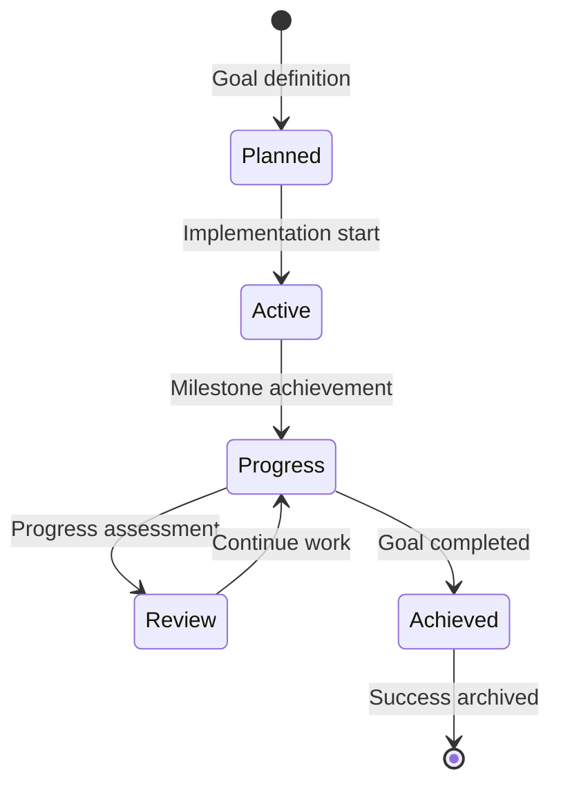

**Implementation Characteristics**:
- **Tag Pattern**: `[goal, plan]` → `[goal, plan, active]` → `[goal, plan, achieved]`
- **Relationship Pattern**: Parent strategy claims, child milestone claims
- **Completion Criteria**: High confidence (≥0.90) representing goal achievement
- **Skill Requirements**: Project management, progress monitoring, resource allocation

**Processing Steps**:
1. **Goal Definition**: Establish clear, measurable objectives
2. **Planning**: Create implementation roadmap with milestones
3. **Active Progress**: Execute plan with regular progress tracking
4. **Milestone Review**: Assess progress against targets
5. **Goal Achievement**: Reach defined objectives with validation

**Example Workflow**:
```yaml
# Goal Definition
input: "Reduce customer support response time from 24 hours to 2 hours"
intent: Goal Achievement
confidence: 0.10

# Planning Phase
planning:
  milestones:
    - "Implement automated ticket routing" (target: 12 hours)
    - "Expand support team" (target: 6 hours)
    - "Implement knowledge base" (target: 2 hours)
  timeline: "6 months"
confidence: 0.25

# Progress Tracking
progress_updates:
  - "Automated routing implemented: 10-hour average" (c: 0.40)
  - "Team expanded: 6-hour average" (c: 0.65)
  - "Knowledge base launched: 2.5-hour average" (c: 0.85)
confidence: 0.85

# Goal Achievement
achievement: "Successfully reduced customer support response time from 24 hours to 2 hours through automation, team expansion, and knowledge base implementation"
final_confidence: 0.95
```

### **5. Reference Integration (reference)**

#### **Purpose**: Source provenance and reliability assessment

**Intent Patterns**:
- Source words: "according to", "research shows", "source states"
- Citation contexts: "reference", "cite", "source", "according to"
- Quality assessment: "evaluate source", "assess credibility"

**Confidence Evolution**: Static (0.10-0.95) based on source quality assessment

**Processing Workflow**:
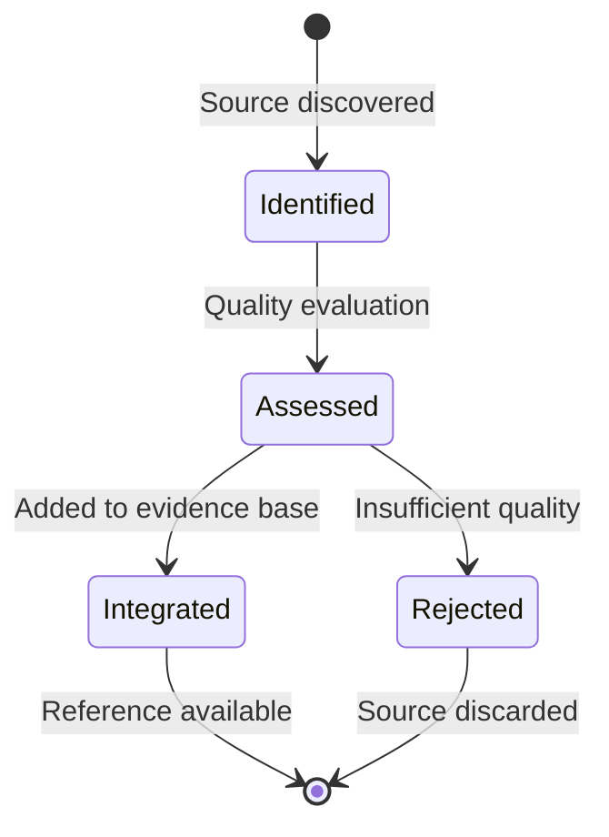

**Implementation Characteristics**:
- **Tag Pattern**: `[reference]` → `[reference, validated/credible/unverified]`
- **Relationship Pattern**: No parent claims, only child claims that use the reference
- **Completion Criteria**: Quality assessment complete, confidence assigned
- **Skill Requirements**: Source evaluation, credibility assessment, quality judgment

**Processing Steps**:
1. **Source Identification**: Discover and capture reference information
2. **Quality Assessment**: Evaluate source credibility and reliability
3. **Metadata Extraction**: Extract key information for citation
4. **Integration**: Add to evidence base with appropriate confidence
5. **Validation**: Ongoing quality monitoring and updates

**Example Workflow**:
```yaml
# Source Identification
input: "Harvard Business Review article on remote work productivity"
intent: Reference Integration
confidence: 0.30

# Quality Assessment
assessment:
  source_type: "Academic business journal"
  peer_review: "Yes, editorial review process"
  author_credentials: "PhD, business school professor"
  publication_reputation: "High impact factor (8.7)"
  methodology: "Survey of 500 companies, statistical analysis"
confidence: 0.85

# Integration
integrated_reference: "Harvard Business Review, 2024. 'Remote Work Productivity: Comprehensive Analysis.' Dr. Jennifer Martinez, Harvard Business School. Survey of 500 companies with statistical validation"
final_confidence: 0.85
```

## 🔄 **Cross-Approach Integration**

### **Hybrid Processing Scenarios**

#### **Processing Evolution Patterns**
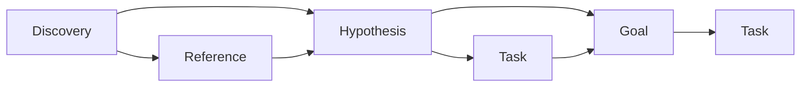

**Transition Rules**:
1. **Discovery → Hypothesis**: When sufficient evidence supports specific proposition
2. **Hypothesis → Goal**: When theory validated and implementation decided
3. **Task → Goal**: When task identified as part of larger objective
4. **Reference → Any**: When source quality validated for use

#### **Hybrid Processing Example**
```yaml
# Research Project Evolution
phase_1_discovery:
  content: "Investigate effectiveness of AI in healthcare diagnostics"
  approach: Discovery Processing
  confidence: 0.25

phase_2_hypothesis:
  content: "AI improves diagnostic accuracy by 30% in medical imaging"
  approach: Hypothesis Validation
  confidence: 0.40

phase_3_goal:
  content: "Implement AI diagnostic system achieving 30% accuracy improvement"
  approach: Goal Achievement
  confidence: 0.70

phase_4_tasks:
  content: "Develop machine learning model for medical image analysis"
  approach: Task Execution
  confidence: 0.85
```

### **Skill-Enabled Processing Integration**

#### **Skill Selection Algorithm**
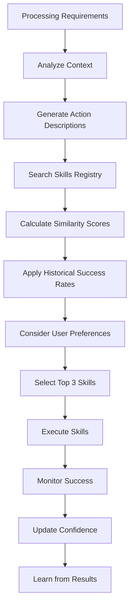

#### **Skill-Processing Matrix**
```yaml
skill_processing_matrix:
  discovery_skills:
    - research_methodology
    - data_analysis
    - pattern_recognition
    - synthesis_techniques
    examples:
      - "Literature review using semantic search"
      - "Statistical analysis of research data"
      - "Pattern identification across multiple sources"
    
  task_execution_skills:
    - implementation_techniques
    - tool_usage
    - debugging_methods
    - quality_assurance
    examples:
      - "Code implementation with testing"
      - "System configuration and deployment"
      - "Process automation and optimization"
    
  hypothesis_validation_skills:
    - statistical_analysis
    - experimental_design
    - evidence_evaluation
    - logical_reasoning
    examples:
      - "A/B test design and analysis"
      - "Statistical significance testing"
      - "Evidence synthesis and evaluation"
    
  goal_achievement_skills:
    - project_management
    - progress_monitoring
    - resource_allocation
    - milestone_tracking
    examples:
      - "Project planning and execution"
      - "Progress tracking and reporting"
      - "Resource optimization and allocation"
    
  reference_integration_skills:
    - source_evaluation
    - credibility_assessment
    - bias_detection
    - quality_judgment
    examples:
      - "Academic source credibility assessment"
      - "Media bias detection and analysis"
      - "Quality scoring for reference materials"
```

## ⚡ **Performance Optimization**

### **Processing Efficiency Strategies**

#### **Intelligent Routing**
```yaml
routing_optimization:
  intent_classification:
    - semantic_similarity_to_existing_claims
    - user_intent_detection
    - context_pattern_recognition
    - historical_processing_patterns
    
  approach_selection:
    - primary_intent_match
    - confidence_pattern_appropriateness
    - relationship_compatibility
    - resource_availability
    
  execution_optimization:
    - batch_similar_processing
    - cache_frequently_used_patterns
    - learn_from_user_preferences
    - predictive_skill_selection
```

#### **Caching Strategies**
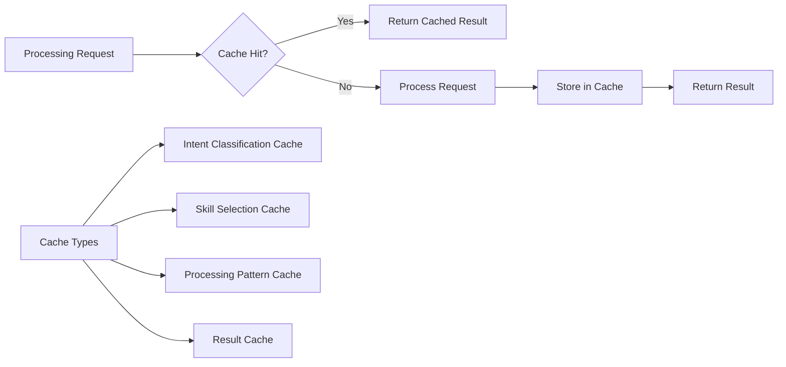

#### **Resource Management**
```yaml
resource_constraints:
  processing_limits:
    max_concurrent_requests: 10
    default_timeout: 300s
    max_memory_per_request: 2GB
    
  skill_execution:
    default_tool_timeout: 60s
    max_concurrent_tools: 1 (single-threaded)
    response_chunk_size: 1000 tokens
    
  cache_management:
    max_cache_size: 1GB
    cache_ttl: 24 hours
    lru_eviction_policy: true
```

### **Quality Assurance**

#### **Processing Validation**
```yaml
validation_checks:
  input_validation:
    - request_format_verification
    - intent_classification_accuracy
    - context_completeness_check
    
  processing_monitoring:
    - skill_execution_success_rate
    - confidence_progression_validation
    - relationship_integrity_check
    
  output_quality:
    - resolution_completeness
    - evidence_traceability
    - user_satisfaction_tracking
```

#### **Error Recovery**
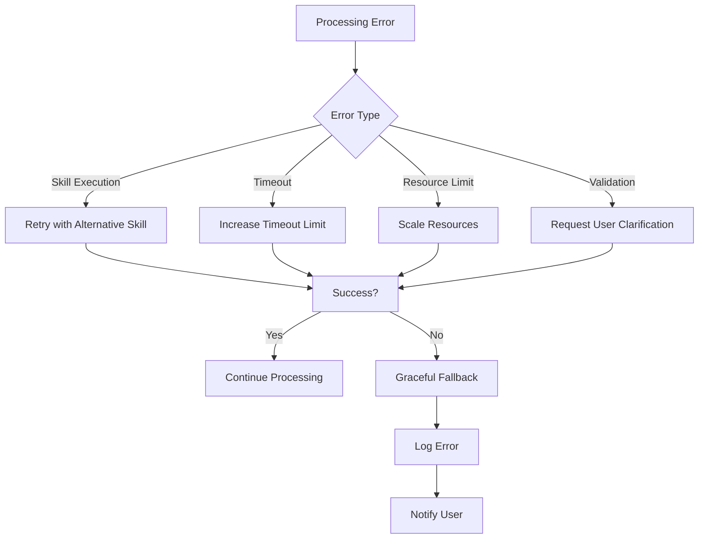

## 📊 **Success Metrics**

### **Processing Performance Metrics**

| Metric | Target | Measurement Method |
|--------|--------|-------------------|
| **Intent Classification Accuracy** | >95% | Manual validation of sample requests |
| **Processing Success Rate** | >98% | Successful completion tracking |
| **Average Processing Time** | <30s | End-to-end timing measurement |
| **Skill Selection Accuracy** | >90% | User satisfaction with selected skills |
| **Confidence Progression** | Logical progression | Confidence score validation |

### **Quality Metrics**

| Metric | Target | Frequency |
|--------|--------|-----------|
| **Resolution Completeness** | >95% | Per-request evaluation |
| **Evidence Traceability** | 100% | Continuous monitoring |
| **User Satisfaction** | >4.5/5 | Quarterly surveys |
| **System Reliability** | 99.9% uptime | Continuous monitoring |
| **Learning Effectiveness** | Measurable improvement | Monthly analysis |

This ProcessingWorkflows document provides comprehensive, unified guidance for all Conjecture processing operations, consolidating scattered processing logic into a single reference while maintaining complete operational coverage and performance optimization strategies.
