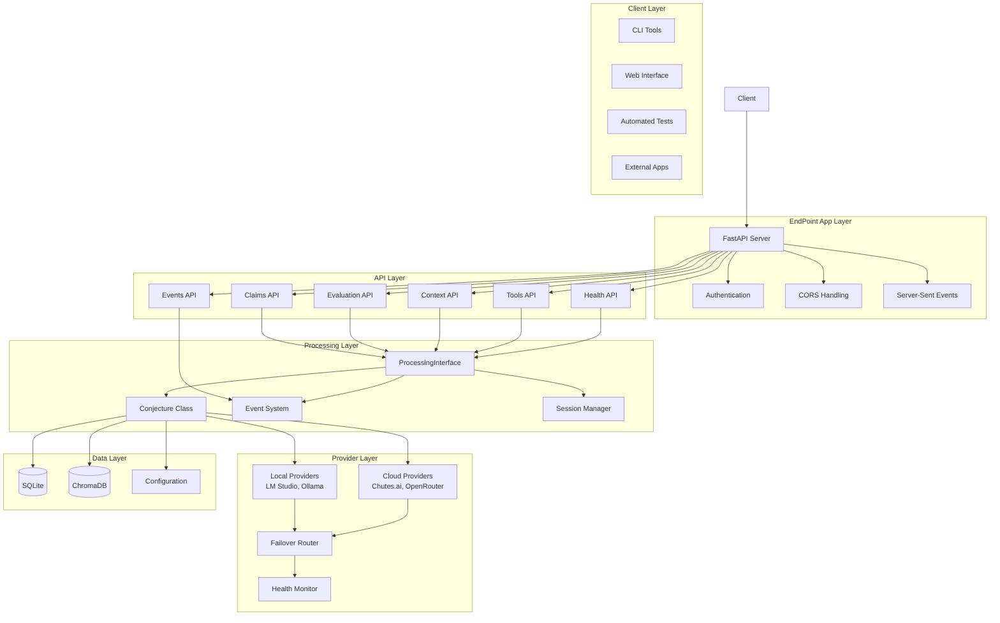

# EndPoint App Architecture Specification

## Overview

The EndPoint App is a lightweight, transparent FastAPI application that serves as a simple testing interface for the Conjecture processing layer. It provides direct access to the ProcessingInterface with minimal overhead, enabling rapid validation and debugging of the Conjecture system.

## Design Principles

### 1. Minimal Overhead
- **Lightweight FastAPI**: Direct FastAPI implementation without unnecessary abstraction layers
- **Direct ProcessingInterface Calls**: No intermediate service layers - direct calls to ProcessingInterface methods
- **Simple Request/Response**: Clean, straightforward API patterns with Pydantic models

### 2. Transparent Access
- **Direct Inspection**: All processing results directly exposed without transformation
- **Real-time Event Streaming**: Server-Sent Events for live debugging and monitoring
- **State Management**: Full session and state visibility for debugging

### 3. Provider Routing
- **Dynamic Selection**: Automatic provider selection based on configuration
- **Failover Support**: Graceful degradation when providers fail
- **Performance Monitoring**: Built-in metrics and health checks

## Architecture Diagram



## Core Components

### 1. FastAPI Application (`src/interfaces/endpoint_app.py`)

```python
from fastapi import FastAPI, HTTPException, Depends, BackgroundTasks
from fastapi.middleware.cors import CORSMiddleware
from fastapi.responses import StreamingResponse
from contextlib import asynccontextmanager
import asyncio

class EndPointApp:
    """Main EndPoint application with ProcessingInterface integration"""
    
    def __init__(self):
        self.processing_interface = None
        self.event_stream_manager = None
        self.provider_router = None
        self.health_monitor = None
```

### 2. API Router Structure

#### Claims API (`src/interfaces/api/claims_api.py`)
- `POST /claims` - Create new claim
- `GET /claims/{claim_id}` - Retrieve specific claim
- `PUT /claims/{claim_id}` - Update existing claim
- `DELETE /claims/{claim_id}` - Delete claim
- `GET /claims/search` - Search claims with filters
- `POST /claims/batch` - Batch create claims

#### Evaluation API (`src/interfaces/api/evaluation_api.py`)
- `POST /evaluate` - Evaluate single claim
- `POST /evaluate/batch` - Batch evaluate claims
- `GET /evaluate/{claim_id}/result` - Get evaluation result
- `POST /evaluate/{claim_id}/rerun` - Re-run evaluation

#### Context API (`src/interfaces/api/context_api.py`)
- `GET /context` - Get context for operations
- `POST /context/build` - Build context for specific claims
- `GET /context/{session_id}` - Get session context

#### Tools API (`src/interfaces/api/tools_api.py`)
- `GET /tools` - List available tools
- `POST /tools/{tool_name}/execute` - Execute tool
- `GET /tools/{tool_name}/schema` - Get tool schema

#### Events API (`src/interfaces/api/events_api.py`)
- `GET /events` - Server-Sent Events stream
- `POST /events/subscribe` - Subscribe to events
- `DELETE /events/subscribe/{sub_id}` - Unsubscribe from events

#### Health API (`src/interfaces/api/health_api.py`)
- `GET /health` - System health check
- `GET /health/providers` - Provider health status
- `GET /metrics` - Performance metrics

### 3. Provider Router (`src/interfaces/provider_router.py`)

```python
class ProviderRouter:
    """Dynamic provider routing with failover support"""
    
    async def route_request(self, request_type: str, **kwargs):
        """Route request to best available provider"""
        
    async def test_provider_health(self, provider_config: dict):
        """Test provider connectivity and responsiveness"""
        
    async def get_provider_metrics(self, provider_name: str):
        """Get performance metrics for specific provider"""
```

### 4. Event Stream Manager (`src/interfaces/event_stream_manager.py`)

```python
class EventStreamManager:
    """Manage Server-Sent Events for real-time monitoring"""
    
    async def stream_events(self, session_id: Optional[str] = None):
        """Stream events as Server-Sent Events"""
        
    async def subscribe_to_events(self, callback: Callable, filters: dict):
        """Subscribe to specific event types"""
        
    async def publish_event(self, event: ProcessingEvent):
        """Publish event to all subscribers"""
```

## API Models

### Request Models

```python
from pydantic import BaseModel, Field
from typing import Optional, List, Dict, Any

class CreateClaimRequest(BaseModel):
    content: str = Field(..., min_length=5, max_length=2000)
    confidence: Optional[float] = Field(None, ge=0.0, le=1.0)
    tags: Optional[List[str]] = Field(default_factory=list)
    scope: Optional[str] = Field(default="user-workspace")
    session_id: Optional[str] = None

class UpdateClaimRequest(BaseModel):
    content: Optional[str] = Field(None, min_length=5, max_length=2000)
    confidence: Optional[float] = Field(None, ge=0.0, le=1.0)
    tags: Optional[List[str]] = None
    state: Optional[str] = None

class SearchClaimsRequest(BaseModel):
    query: str = Field(..., min_length=1)
    filters: Optional[Dict[str, Any]] = Field(default_factory=dict)
    limit: Optional[int] = Field(100, ge=1, le=1000)
    offset: Optional[int] = Field(0, ge=0)

class EvaluateClaimRequest(BaseModel):
    claim_id: str = Field(..., min_length=1)
    session_id: Optional[str] = None
    force_revaluate: Optional[bool] = False

class ExecuteToolRequest(BaseModel):
    tool_name: str = Field(..., min_length=1)
    parameters: Dict[str, Any] = Field(default_factory=dict)
    session_id: Optional[str] = None
```

### Response Models

```python
class ClaimResponse(BaseModel):
    success: bool
    claim: Optional[Dict[str, Any]] = None
    error: Optional[str] = None
    timestamp: datetime

class EvaluationResponse(BaseModel):
    success: bool
    result: Optional[Dict[str, Any]] = None
    error: Optional[str] = None
    processing_time: Optional[float] = None
    timestamp: datetime

class ContextResponse(BaseModel):
    success: bool
    context: Optional[Dict[str, Any]] = None
    metadata: Optional[Dict[str, Any]] = None
    error: Optional[str] = None
    timestamp: datetime

class ToolResponse(BaseModel):
    success: bool
    result: Optional[Dict[str, Any]] = None
    error: Optional[str] = None
    duration: Optional[float] = None
    timestamp: datetime

class HealthResponse(BaseModel):
    status: str  # "healthy", "degraded", "unhealthy"
    providers: Dict[str, Dict[str, Any]]
    database_status: Dict[str, str]
    uptime: float
    version: str
    timestamp: datetime
```

## Provider Integration Design

### 1. Provider Configuration

```python
class ProviderConfig(BaseModel):
    name: str
    type: str  # "local" or "cloud"
    url: str
    api_key: Optional[str] = None
    model: str
    priority: int = Field(1, ge=1, le=10)  # 1 = highest priority
    timeout: int = Field(60, ge=5, le=300)
    max_retries: int = Field(3, ge=0, le=10)
    health_check_interval: int = Field(30, ge=5, le=300)  # seconds
```

### 2. Failover Strategy

1. **Primary Provider**: Use highest priority healthy provider
2. **Health Monitoring**: Continuous health checks with configurable intervals
3. **Automatic Failover**: Switch to next healthy provider on failure
4. **Recovery**: Automatically switch back to primary provider when healthy
5. **Circuit Breaker**: Temporarily disable failing providers

### 3. Performance Monitoring

- **Response Times**: Track per-provider response times
- **Success Rates**: Monitor success/failure ratios
- **Error Types**: Categorize and track different error types
- **Throughput**: Monitor requests per second
- **Resource Usage**: Track CPU, memory, and network usage

## Event Streaming Implementation

### Server-Sent Events (SSE)

```python
async def events_stream(
    request: Request,
    session_id: Optional[str] = None,
    event_types: Optional[List[str]] = None
):
    """Stream processing events in real-time"""
    
    async def event_generator():
        try:
            # Subscribe to events
            subscription_id = await event_manager.subscribe(
                session_id=session_id,
                event_types=event_types,
                callback=lambda event: yield f"data: {event.to_json()}\n\n"
            )
            
            # Keep connection alive
            while True:
                await asyncio.sleep(1)
                yield "data: {\"type\": \"heartbeat\"}\n\n"
                
        except asyncio.CancelledError:
            # Clean up subscription
            await event_manager.unsubscribe(subscription_id)
    
    return StreamingResponse(
        event_generator(),
        media_type="text/event-stream",
        headers={
            "Cache-Control": "no-cache",
            "Connection": "keep-alive",
            "Access-Control-Allow-Origin": "*",
        }
    )
```

### Event Types

- `claim_created` - New claim created
- `claim_evaluated` - Claim evaluation completed
- `claim_updated` - Claim updated
- `tool_called` - Tool execution started
- `tool_completed` - Tool execution completed
- `response_generated` - LLM response generated
- `session_created` - New session created
- `session_resumed` - Session resumed
- `context_built` - Context building completed
- `error_occurred` - Error occurred
- `progress_update` - Progress update
- `provider_switched` - Provider failover occurred

## Testing Strategy

### 1. Unit Tests

- **API Endpoint Tests**: Test each endpoint with various inputs
- **Model Validation Tests**: Test Pydantic model validation
- **Provider Router Tests**: Test routing and failover logic
- **Event Stream Tests**: Test SSE functionality
- **Error Handling Tests**: Test error scenarios and recovery

### 2. Integration Tests

- **ProcessingInterface Integration**: Test integration with ProcessingInterface
- **Provider Integration**: Test with real and mock providers
- **Database Integration**: Test database operations
- **Event System Integration**: Test event publishing and subscription

### 3. Performance Tests

- **Load Testing**: Test under high request volumes
- **Stress Testing**: Test system limits and degradation
- **Latency Testing**: Measure response times under various conditions
- **Memory Testing**: Monitor memory usage and leaks

### 4. End-to-End Tests

- **Full Workflow Tests**: Test complete claim creation → evaluation → context building
- **Multi-Session Tests**: Test concurrent session handling
- **Failover Tests**: Test provider failover scenarios
- **Event Streaming Tests**: Test real-time event delivery

## Security Considerations

### 1. Authentication

- **API Key Support**: Optional API key authentication
- **Session Management**: Secure session token generation
- **Rate Limiting**: Prevent abuse with configurable rate limits

### 2. Input Validation

- **Pydantic Models**: Strict input validation for all endpoints
- **SQL Injection Prevention**: Use parameterized queries
- **XSS Prevention**: Sanitize user inputs

### 3. Access Control

- **Scope-Based Access**: Respect claim scope permissions
- **Session Isolation**: Ensure session data isolation
- **Resource Limits**: Prevent resource exhaustion attacks

## Configuration Management

### 1. Application Configuration

```python
class EndPointConfig(BaseModel):
    host: str = "0.0.0.0"
    port: int = 8000
    debug: bool = False
    cors_origins: List[str] = ["*"]
    max_request_size: int = 10 * 1024 * 1024  # 10MB
    request_timeout: int = 300  # 5 minutes
    event_stream_timeout: int = 3600  # 1 hour
    log_level: str = "INFO"
```

### 2. Provider Configuration

```python
class ProviderManagerConfig(BaseModel):
    providers: List[ProviderConfig] = Field(default_factory=list)
    health_check_interval: int = 30
    failover_timeout: int = 10
    max_concurrent_requests: int = 100
    enable_metrics: bool = True
```

## Deployment Architecture

### 1. Development Environment

- **Local Development**: Run with `uvicorn src.interfaces.endpoint_app:app --reload`
- **Mock Providers**: Use mock providers for testing
- **Hot Reload**: Enable code reloading during development

### 2. Production Environment

- **Container Deployment**: Docker container with health checks
- **Load Balancing**: Multiple instances behind load balancer
- **Monitoring**: Integrated with monitoring and alerting
- **Logging**: Structured logging with log aggregation

### 3. Scaling Considerations

- **Horizontal Scaling**: Multiple instances for high availability
- **Database Scaling**: Connection pooling and query optimization
- **Event Stream Scaling**: Redis pub/sub for event distribution
- **Caching**: Redis for frequently accessed data

## Migration Plan

### Phase 1: Foundation (Week 1-2)

1. **Setup FastAPI Application**: Basic FastAPI app with routing
2. **Implement ProcessingInterface Integration**: Connect to existing ProcessingInterface
3. **Basic API Endpoints**: Implement core CRUD operations for claims
4. **Configuration Management**: Setup configuration system

### Phase 2: Core Features (Week 3-4)

1. **Provider Router**: Implement dynamic provider routing
2. **Event Streaming**: Add Server-Sent Events support
3. **Health Monitoring**: Implement health checks and metrics
4. **Error Handling**: Comprehensive error handling and recovery

### Phase 3: Advanced Features (Week 5-6)

1. **Batch Operations**: Implement batch processing endpoints
2. **Performance Optimization**: Caching and optimization
3. **Security**: Add authentication and authorization
4. **Testing**: Comprehensive test suite

### Phase 4: Production Ready (Week 7-8)

1. **Documentation**: Complete API documentation
2. **Monitoring**: Production monitoring and alerting
3. **Deployment**: Production deployment configuration
4. **Migration Tools**: Tools for migrating from existing EndPoint

## Success Metrics

### 1. Functional Metrics

- **API Coverage**: 100% of ProcessingInterface methods exposed
- **Provider Support**: All configured providers working
- **Event Streaming**: Real-time event delivery with <100ms latency
- **Failover Time**: <5 seconds to switch providers

### 2. Performance Metrics

- **Response Time**: 95th percentile <2 seconds for single operations
- **Throughput**: >100 requests per second
- **Availability**: 99.9% uptime
- **Memory Usage**: <512MB for typical workload

### 3. Quality Metrics

- **Test Coverage**: >90% code coverage
- **Documentation**: 100% API documentation coverage
- **Error Rate**: <1% error rate for valid requests
- **Security**: Zero critical security vulnerabilities

## Conclusion

The EndPoint App architecture provides a clean, minimal interface to the Conjecture ProcessingInterface while maintaining transparency and enabling rapid testing and validation. The design prioritizes simplicity, performance, and reliability while providing the necessary features for comprehensive testing and debugging of the Conjecture system.

The modular architecture allows for easy extension and customization while maintaining clear separation of concerns. The provider routing system ensures reliable operation even when individual providers fail, and the event streaming system provides real-time visibility into system operations.

This architecture serves as a solid foundation for both testing and production use cases, enabling rapid development and deployment of Conjecture-based applications.