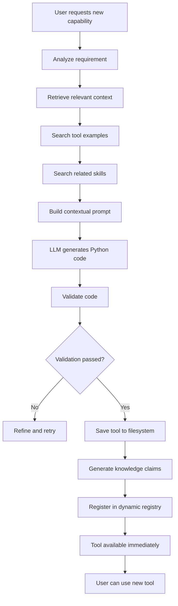

# **Dynamic Tooling Implementation Plan**

## **Overview**

Dynamic Tooling represents the most critical architectural evolution for Conjecture - transitioning from a **static tool user** to a **self-improving tool creator**. This implementation plan outlines the complete roadmap for enabling the LLM to write, validate, and deploy new Python tools at runtime.

---

## **🎯 Current State vs. Vision**

### **Current Implementation (Static Tooling)**
- Tools are manually registered using `@register_tool` decorators
- Tool examples are hardcoded as strings in Python functions
- Capabilities are limited to pre-registered tools
- Adding new tools requires code changes and restarts

### **Target Vision (Dynamic Tooling)**
- LLM can create new tools on-demand based on user requirements
- Tools are stored as files and loaded dynamically from the filesystem
- Tool examples are stored as searchable Claims in the knowledge graph
- System becomes more capable through accumulated experience

---

## **🏗️ Architecture Components**

### **1. Dynamic Tool Registry**
**File:** `src/tools/dynamic_registry.py`

```python
class DynamicToolRegistry:
    """Manages runtime loading and registration of tools from filesystem"""
    
    def __init__(self, tools_directory: str = "tools/"):
        self.tools_directory = Path(tools_directory)
        self.tools = {}
        self.file_watcher = None
        self.setup_file_watcher()
    
    def load_tools_from_directory(self):
        """Scan directory for .py files and load as tools"""
        
    def reload_tool(self, tool_name: str):
        """Hot-reload a tool without restarting"""
        
    def watch_directory(self):
        """File system watcher for automatic tool updates"""
        
    def validate_tool_file(self, file_path: Path) -> bool:
        """Ensure tool file meets safety and quality standards"""
```

### **2. Tool Creator Agent**
**File:** `src/processing/tool_creator.py`

```python
class ToolCreator:
    """Enables LLM to write and validate new Python tools"""
    
    async def create_tool(self, requirement: str, context: List[Claim]) -> Tool:
        """
        Main workflow for tool creation:
        1. Retrieve relevant examples and skills
        2. Build context for LLM
        3. Generate Python code
        4. Validate and save tool
        """
        
    def build_tool_creation_context(self, requirement: str, examples: List[Claim], skills: List[Claim]) -> str:
        """Construct contextual prompt for LLM"""
        
    async def generate_tool_code(self, context: str) -> str:
        """LLM generates Python code based on context"""
        
    async def validate_and_save_tool(self, tool_code: str) -> Tool:
        """Validate, test, and persist new tool"""
```

### **3. Tool Code Validator**
**File:** `src/processing/tool_validator.py`

```python
class ToolValidator:
    """Ensures generated tool code is safe and functional"""
    
    async def validate_tool_code(self, code: str) -> ValidationResult:
        """Multi-layer validation pipeline"""
        
    def validate_syntax(self, code: str) -> ValidationResult:
        """Python syntax validation"""
        
    def validate_security(self, code: str) -> ValidationResult:
        """Security and safety checks"""
        
    def validate_signature(self, code: str) -> ValidationResult:
        """Function signature and type hints"""
        
    async def execute_in_sandbox(self, code: str) -> ValidationResult:
        """Test execution in isolated environment"""
```

### **4. Automatic Knowledge Generation**
**File:** `src/processing/knowledge_generator.py`

```python
class KnowledgeGenerator:
    """Automatically creates skill and example claims for new tools"""
    
    async def generate_tool_knowledge(self, tool: Tool) -> List[Claim]:
        """Create skill and sample claims for new tool"""
        
    def generate_skill_claim(self, tool: Tool) -> Claim:
        """Create how-to guide for using the tool"""
        
    def generate_sample_claims(self, tool: Tool) -> List[Claim]:
        """Create example usage claims"""
        
    async def extract_documentation(self, tool: Tool) -> str:
        """Extract and format tool documentation"""
```

---

## **🔄 Dynamic Tooling Workflow**

### **User Request Processing**


### **Example Scenario: "Create a CSV data analyzer"**

1. **Context Retrieval**
```python
# System finds relevant knowledge:
relevant_claims = [
    Claim("Use pandas to read CSV files", tags=["skill", "pandas"]),
    Claim("read_csv('file.csv') loads data into DataFrame", tags=["tool_example", "pandas"]),
    Claim("Data analysis requires statistical functions", tags=["concept", "analysis"])
]
```

2. **LLM Code Generation**
```python
# Generated tool code:
def analyze_csv_data(file_path: str, analysis_type: str = "summary") -> Dict[str, Any]:
    """
    Analyze CSV data and return statistical summary
    
    Args:
        file_path: Path to CSV file
        analysis_type: Type of analysis ('summary', 'correlation', 'distribution')
    
    Returns:
        Dictionary containing analysis results
    """
    import pandas as pd
    import numpy as np
    
    # Load and analyze data
    df = pd.read_csv(file_path)
    
    if analysis_type == "summary":
        return {
            "shape": df.shape,
            "columns": list(df.columns),
            "dtypes": df.dtypes.to_dict(),
            "describe": df.describe().to_dict()
        }
    elif analysis_type == "correlation":
        return df.corr().to_dict()
    # ... more analysis types
```

3. **Knowledge Capture**
```python
# Automatically created claims:
skill_claim = Claim(
    "To analyze CSV data: use analyze_csv_data(file_path, analysis_type)",
    tags=["skill", "analyze_csv_data", "csv", "data_analysis"]
)

sample_claim = Claim(
    "analyze_csv_data('sales_data.csv', 'summary') returns statistical summary",
    tags=["tool_example", "analyze_csv_data", "csv"]
)
```

---

## **🛠️ Technical Implementation Details**

### **File System Structure**
```
tools/
├── core/                    # Built-in core tools
│   ├── web_search.py
│   ├── file_operations.py
│   └── claim_management.py
├── generated/               # LLM-created tools
│   ├── csv_analyzer.py
│   ├── minesweeper_game.py
│   └── weather_checker.py
├── community/               # User-contributed tools
│   ├── database_connector.py
│   └── api_client.py
└── sandbox/                 # Testing environment
    └── test_runner.py
```

### **Tool File Template**
```python
# tools/generated/csv_analyzer.py
"""
Auto-generated tool: CSV Data Analyzer
Created: 2025-11-27
Context: Data analysis, file processing, statistics
"""

from typing import Dict, Any, List
import pandas as pd
import numpy as np

def analyze_csv_data(file_path: str, analysis_type: str = "summary") -> Dict[str, Any]:
    """
    Analyze CSV data and return statistical summary
    
    Args:
        file_path: Path to CSV file
        analysis_type: Type of analysis ('summary', 'correlation', 'distribution')
    
    Returns:
        Dictionary containing analysis results
    """
    # Implementation here

def examples():
    """Usage examples for this tool"""
    return [
        "analyze_csv_data('data.csv', 'summary') returns basic statistics",
        "analyze_csv_data('sales.csv', 'correlation') returns correlation matrix"
    ]

# Tool metadata
TOOL_INFO = {
    "name": "analyze_csv_data",
    "description": "Analyze CSV data files",
    "version": "1.0.0",
    "tags": ["csv", "data_analysis", "statistics"],
    "created_by": "ToolCreator",
    "dependencies": ["pandas", "numpy"]
}
```

### **Security and Validation**

**Security Checks:**
- No file system access outside designated directories
- No network requests unless explicitly allowed
- No system command execution
- Memory and CPU usage limits
- Timeout enforcement

**Validation Pipeline:**
```python
class ValidationPipeline:
    def __init__(self):
        self.checks = [
            SyntaxCheck(),
            SecurityCheck(), 
            SignatureCheck(),
            DependencyCheck(),
            SandboxTest(),
            PerformanceCheck()
        ]
    
    async def validate(self, code: str) -> ValidationResult:
        """Run complete validation pipeline"""
        for check in self.checks:
            result = await check.validate(code)
            if not result.passed:
                return result
        return ValidationResult(True, "All checks passed")
```

---

## **📋 Implementation Roadmap**

### **Phase 2A: Dynamic Tool Loading (Week 1-2)**
**Objective:** Enable filesystem-based tool discovery and loading

**Tasks:**
- [ ] Refactor `ToolRegistry` to scan `tools/` directory
- [ ] Implement hot-reloading of tool files
- [ ] Add file system watcher for automatic updates
- [ ] Create tool file template and metadata structure
- [ ] Implement tool versioning and dependency management

**Deliverables:**
- `DynamicToolRegistry` class
- File system watcher implementation
- Tool file template
- Basic hot-reload functionality

### **Phase 2B: Tool Creation Agent (Week 3-4)**
**Objective:** Enable LLM to generate and validate new tools

**Tasks:**
- [ ] Implement `ToolCreator` class with LLM integration
- [ ] Create contextual prompt engineering system
- [ ] Build tool code validation pipeline
- [ ] Implement sandboxed testing environment
- [ ] Add tool code refinement and iteration logic

**Deliverables:**
- `ToolCreator` class
- `ToolValidator` class
- Sandboxed testing environment
- Contextual prompt templates

### **Phase 2C: Automatic Knowledge Generation (Week 5)**
**Objective:** Automatically capture knowledge from new tools

**Tasks:**
- [ ] Implement `KnowledgeGenerator` class
- [ ] Create skill claim generation logic
- [ ] Build sample claim extraction from tool code
- [ ] Integrate with vector search for context retrieval
- [ ] Add knowledge validation and quality checks

**Deliverables:**
- `KnowledgeGenerator` class
- Automatic skill/sample claim creation
- Integration with existing knowledge graph

### **Phase 2D: Integration and Testing (Week 6)**
**Objective:** Complete integration and comprehensive testing

**Tasks:**
- [ ] Integrate all components into main system
- [ ] Create comprehensive test suite
- [ ] Implement safety and security measures
- [ ] Performance optimization and monitoring
- [ ] Documentation and user guides

**Deliverables:**
- Complete dynamic tooling system
- Comprehensive test coverage
- Security and safety documentation
- Performance benchmarks

---

## **🎯 Success Metrics**

### **Functional Metrics**
- [ ] Successfully create and deploy new tools without system restart
- [ ] Tool creation success rate > 85%
- [ ] Tool validation accuracy > 95%
- [ ] Hot-reload functionality works reliably

### **Quality Metrics**
- [ ] Generated tools pass security validation
- [ ] Tool performance meets baseline standards
- [ ] Knowledge generation captures useful examples
- [ ] Context retrieval improves tool quality

### **User Experience Metrics**
- [ ] Tool creation latency < 30 seconds
- [ ] User satisfaction with generated tools > 4.0/5
- [ ] System becomes more capable over time
- [ ] Reduced need for manual tool development

---

## **🔒 Safety and Security Considerations**

### **Code Execution Safety**
- Sandboxed execution environment
- Resource usage limits (CPU, memory, time)
- Restricted file system access
- Network access controls

### **Content Validation**
- Syntax and semantic validation
- Security pattern detection
- Dependency vulnerability scanning
- Manual review for critical tools

### **Knowledge Quality**
- Claim validation and verification
- Example accuracy checking
- Skill documentation quality
- Context relevance scoring

---

## **🚀 Expected Outcomes**

### **Immediate Benefits**
- **Extensibility**: Add new capabilities without core code changes
- **Rapid Prototyping**: Create custom tools for specific user needs
- **Knowledge Accumulation**: System becomes more capable over time
- **User Empowerment**: Users can request custom functionality

### **Long-term Vision**
- **Self-Improving System**: Each tool creates knowledge for future tools
- **Community Contributions**: Users can share tools as files
- **Domain Adaptation**: System specializes for specific use cases
- **Autonomous Evolution**: System can identify and create missing capabilities

---

## **📝 Next Steps**

1. **Review and approve this implementation plan**
2. **Allocate development resources and timeline**
3. **Set up development environment for Phase 2A**
4. **Begin implementation of dynamic tool loading**
5. **Establish testing and validation procedures**

This implementation plan provides a comprehensive roadmap for transforming Conjecture into a truly dynamic, self-extending AI system. The phased approach ensures manageable development while delivering incremental value at each stage.