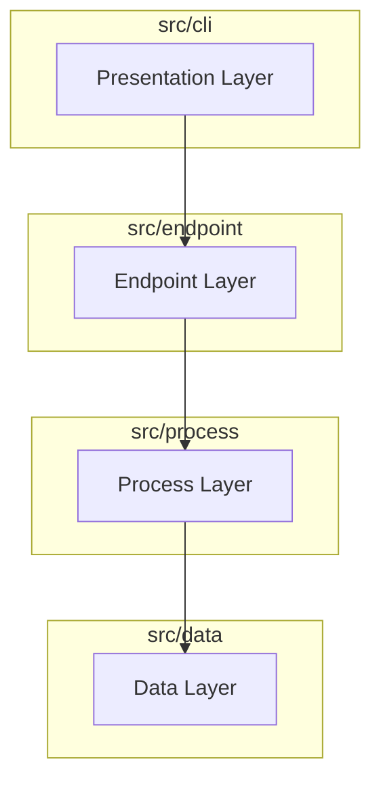

# Conjecture 4-Layer Architecture

**Last Updated:** December 8, 2025
**Version:** 2.0
**Status:** Canonical Source of Truth

## Executive Summary

The Conjecture system uses a **4-Layer Architecture** to ensure modularity, simplicity, and scalability. The core philosophy is **"Universal Claims, Intelligent Processing"**. We maintain a single, universal data model (`Claim`) and offload complexity to the Process Layer, where LLMs identify instructions and relationships dynamically.

## The 4 Layers



### 1. Presentation Layer (`src/cli`)
*   **Responsibility**: User interaction, command parsing, and output formatting.
*   **Constraint**: dumb. It contains NO business logic. It simply instantiates the `ConjectureEndpoint` and displays results.
*   **Components**: CLI (Typer/Rich), TUI, or Web API.

### 2. Endpoint Layer (`src/endpoint`)
*   **Responsibility**: The public API of the system.
*   **Component**: `ConjectureEndpoint` class.
*   **Role**: Orchestrates the flow between Data and Process layers. It is the single entry point for all external consumers.
*   **API**:
    *   `create_claim(content, ...)`
    *   `get_claim(id)`
    *   `evaluate(context)`

### 3. Process Layer (`src/process`)
*   **Responsibility**: Intelligence and Logic.
*   **Components**:
    *   **Context Builder**: Assembles relevant claim graphs.
    *   **LLM Processor**: Interprets context, identifies instructions, and generates insights.
*   **Logic**:
    *   **Instruction ID**: Uses **Tag Hints** (keywords in tags) and LLM analysis to identify executable instructions.
    *   **Relationship Discovery**: LLM suggests new links based on content analysis.

### 4. Data Layer (`src/data`)
*   **Responsibility**: Storage, Retrieval, and Integrity.
*   **Component**: `Universal Claim Model`.
*   **Constraint**: No complex/derived models. Just `Claim`.

## Data Model Specification

### Universal Claim Model
```python
class Claim(BaseModel):
    id: str                 # Unique ID
    content: str            # Make it short, make it clear
    confidence: float       # 0.0 - 1.0
    state: ClaimState       # Explore, Validated, Orphaned, Queued
    type: List[ClaimType]   # Concept, Thesis, etc.
    tags: List[str]         # Organized via Tag Lifecycle
    
    # Bidirectional Relationships
    supports: List[str]     # Claims this claim supports (Upward)
    supported_by: List[str] # Claims that support this claim (Downward)
```

## Context Building Strategy

The "Intelligent Context" is built by traversing the claim graph:

1.  **Traverse Upward (Supports)**: Follow `supports` links to the Root. (100% inclusion).
2.  **Traverse Downward (Supported By)**: Follow `supported_by` links to **Depth 2**.
3.  **Semantic Fill**: If token budget permits, add semantically similar claims.

## Intelligent Processing

### Instruction Identification
Instead of a rigid "Instruction" class, we use:
1.  **Tag Hints**: Tags like `#task`, `#todo`, `#instruction` signal potential instructions.
2.  **LLM Validation**: The Process layer analyzes the content + tags to confirm if it's actionable.

### Tag Lifecycle
*   **Creation**: User adds tags freely.
*   **Consolidation**: Process layer periodically suggests merging synonymous tags.
*   **Retirement**: Unused tags are purged.

## Migration Note
This architecture supersedes all previous "Three-Layer" or "Enhanced" designs. Code matching this spec is the target state.
